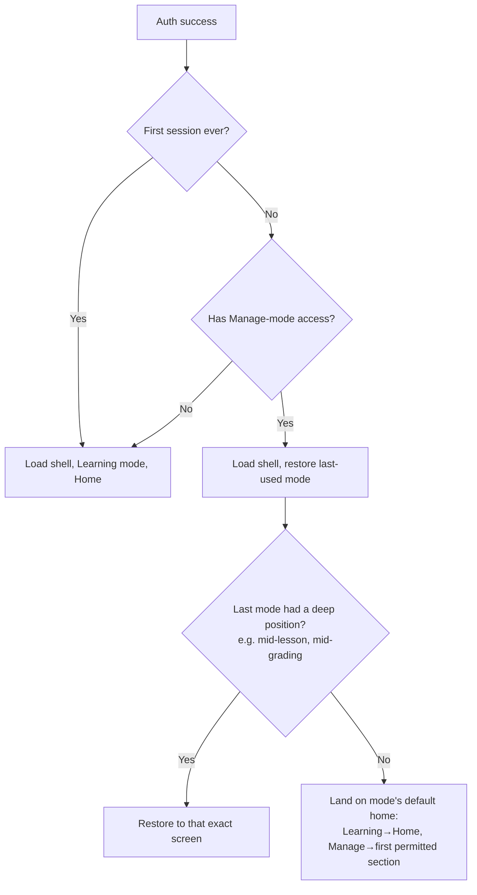
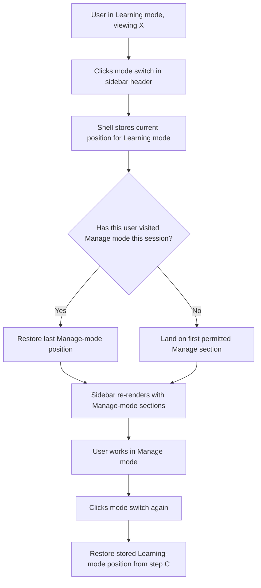
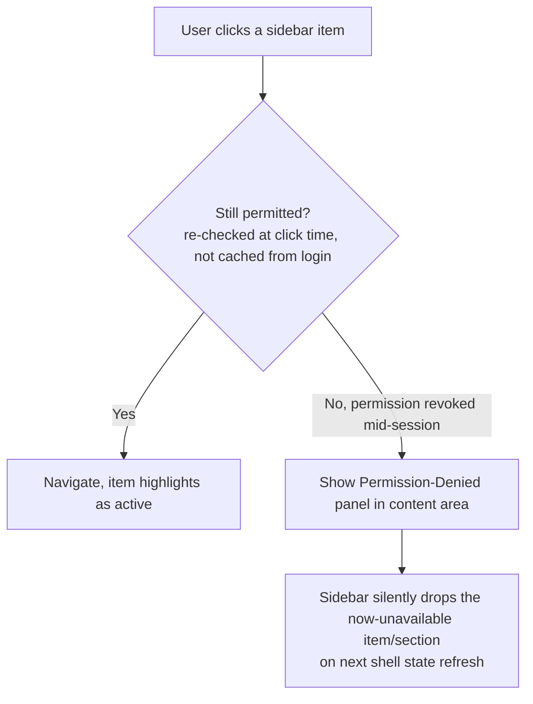
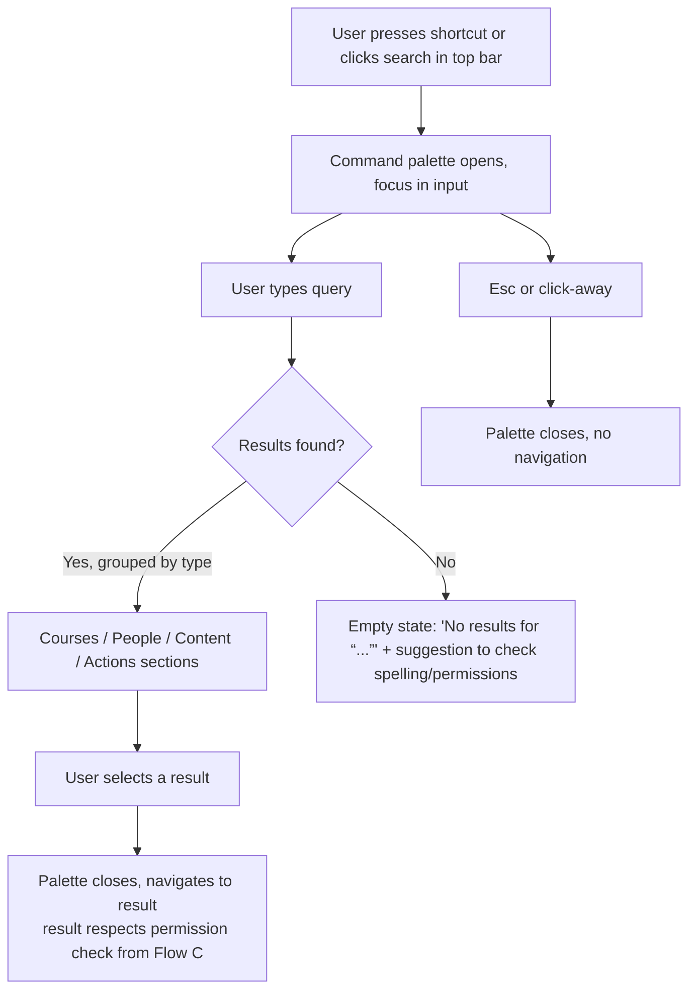
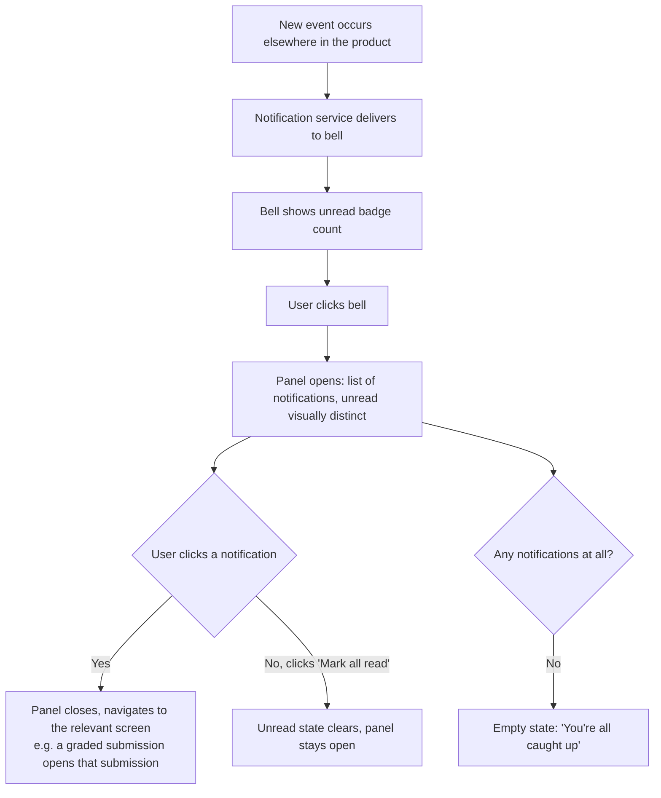
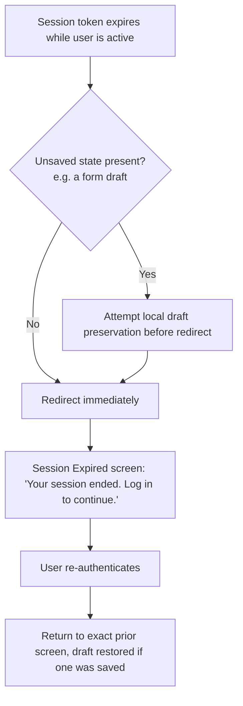
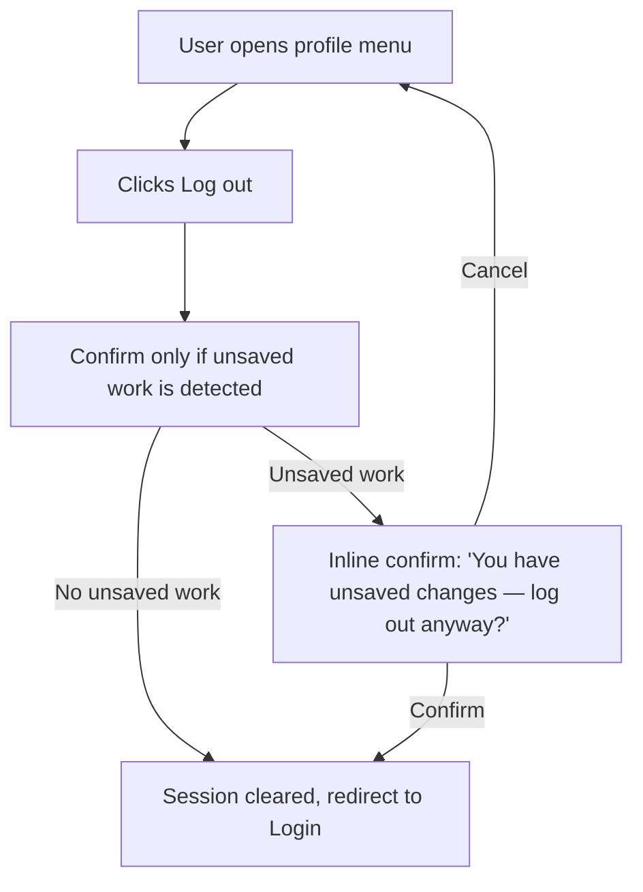
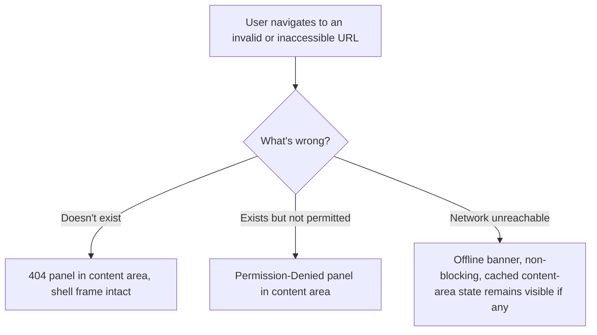

# Step 2 — User Flow — Cross-Cutting Shell

Turns the journeys in [01-user-journey.md](01-user-journey.md) into concrete flows. Each flow below becomes one or more screens/states in Step 3 (Sitemap) and Step 4 (Wireframes).

## Flow A — Post-auth handoff into the shell

- "Last-used mode" and "deep position" are both per-user session state, not per-org — two people in the same org can be in different modes simultaneously.
- Deep-position restore only applies within the same day/session window; a multi-day-old position falls back to the mode's default home rather than dropping someone back into a stale lesson.

## Flow B — Mode switch (Learning ↔ Manage)

- Only accounts with at least one of Instructor/Manager/Org Admin ever see this control — pure Learners skip this flow entirely (no switch renders).
- Switching modes never triggers a full page reload — it's a client-side context change, so it needs to feel instant, not like a navigation.

## Flow C — Sidebar navigation with live permission check

- This is the flow that implements the "role changed mid-session" edge case from Step 1. The permission check happens against a lightweight session/permissions cache that refreshes on navigation — not a full re-auth.

## Flow D — Global search / command palette

- Results are permission-scoped at the query level (a Learner never sees an admin-only page as a search result) rather than shown-then-blocked — avoids leaking the existence of content they can't access.

## Flow E — Notifications

- The bell/panel is a shell-level component, but it's a *consumer* of the shared notification service scoped in [MODULES.md](../../MODULES.md) §18 — this flow only covers the shell-side display, not the service itself.

## Flow F — Session expiry mid-task

## Flow G — Logout

## Flow H — Content-area error states (404 / permission-denied / offline)

- In all three cases the sidebar and top bar keep rendering — the user is never stranded without a way to navigate elsewhere.

## Carried into Step 3 (Sitemap)

Every distinct box in the flows above that isn't just a transient state (palette open/closed) becomes a node in the sitemap: Home (Learning default), Manage-mode default landing, Session Expired, 404, Permission-Denied, Notification panel, Search results.
