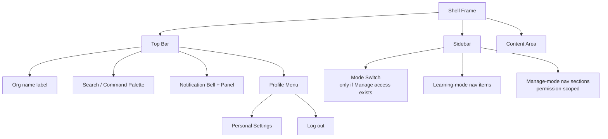
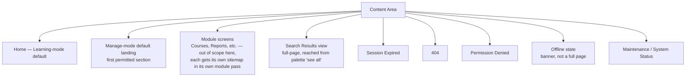

# Step 3 — Sitemap — Cross-Cutting Shell

Every persistent node surfaced by [02-user-flow.md](02-user-flow.md), organized by where it sits in the shell.

## Persistent frame (present on nearly every screen)

## Content-area destinations (what actually loads inside the frame)

## Notes

- **Home** and **Manage-mode default landing** are the only two screens this module fully owns end-to-end; every other content-area destination either belongs to a future module (Courses, Reports, ...) or is a shared system screen (404, Permission Denied, Session Expired, Maintenance) that this module defines *once* for reuse everywhere, rather than each future module reinventing its own 404.
- **Offline** is deliberately not a page — it's a banner state layered over whatever's already on screen, per Flow H.
- Nothing in this sitemap is more than one level deep from the shell frame — that's intentional. The shell's job is to get a user into a module fast, not to have its own deep hierarchy.

## Carried into Step 4 (Wireframes)

Wireframes are needed for: Top Bar, Sidebar (both modes), Home, Manage-mode default landing, Search Results / palette, Notification panel, Session Expired, 404, Permission Denied, Offline banner, Maintenance.
