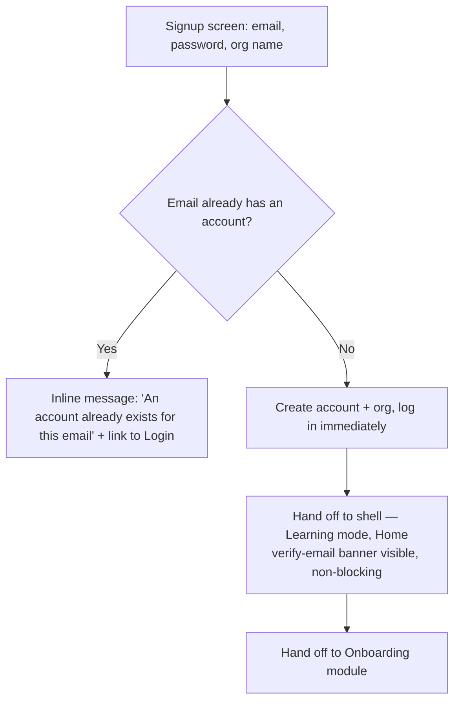
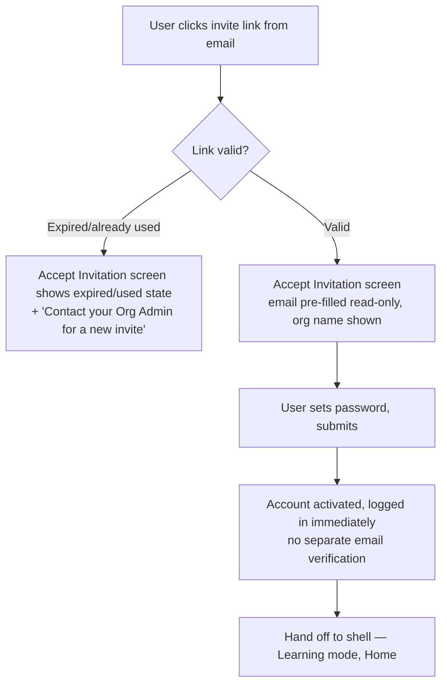
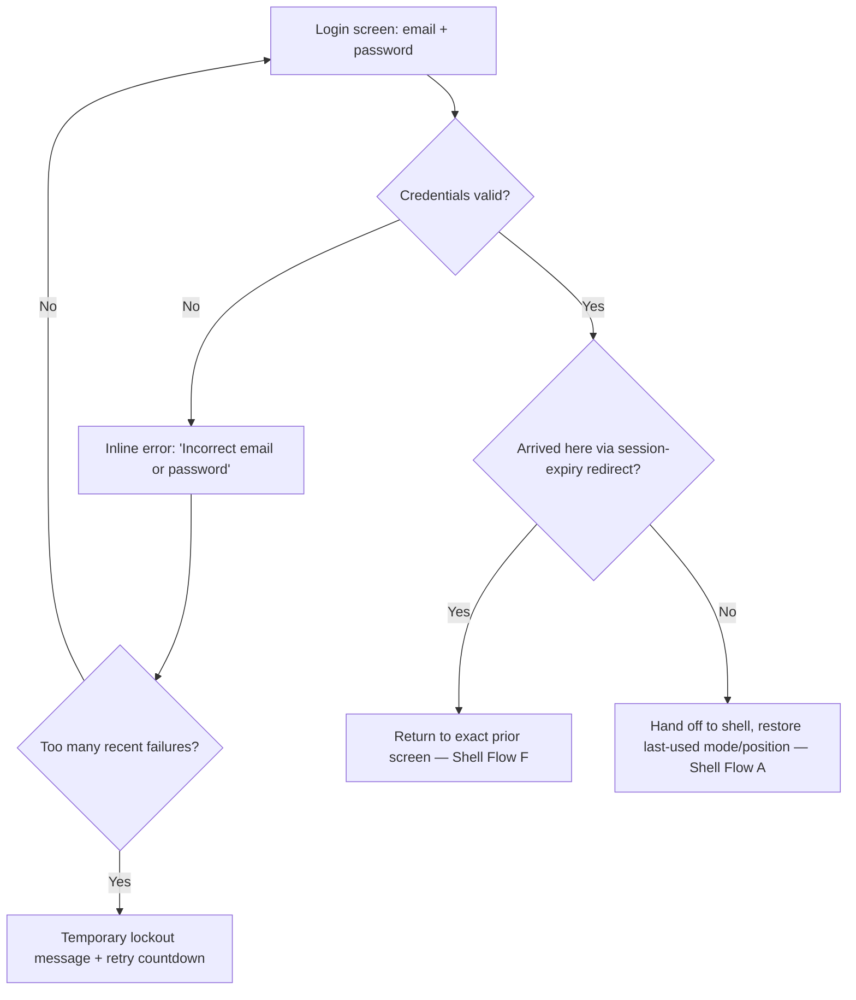
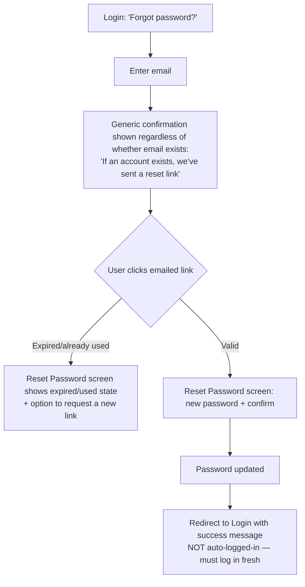

# Step 2 — User Flow — Authentication

Turns [01-user-journey.md](01-user-journey.md) into concrete flows.

## Flow A — Self-serve signup

## Flow B — Invited user accepts

## Flow C — Returning user login

## Flow D — Forgot / reset password

## Notes carried into Step 3 (Sitemap)

- Signup and Accept-Invitation are separate screens with separate entry points, both converging on the same shell hand-off.
- Expired/used-token handling is one shared visual pattern, reused by both the invite link and the reset link — not two different designs.
- The lockout state lives inside the Login flow, not as a separate screen — it's an inline state change on Login itself.
