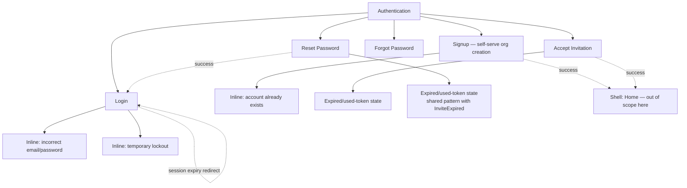

# Step 3 — Sitemap — Authentication

Every distinct screen/state surfaced by [02-user-flow.md](02-user-flow.md).

## Notes

- **5 real screens**: Login, Signup, Accept Invitation, Forgot Password, Reset Password. Everything else in the flows (errors, lockout, expired-token, duplicate-email) is an inline state on one of those five, not a separate screen — keeps this module small, matching "keep it simple."
- **Expired/used-token** is designed once and reused by both Accept Invitation and Reset Password — same visual pattern, different copy.
- No MFA, SSO, or account-locked-screen (a *screen*, as opposed to the inline lockout *state* on Login) in this pass — see [00-open-questions.md](00-open-questions.md).
- **Verify Email** is deliberately not a screen either — it's a non-blocking banner inside the shell (per Journey 1), not part of the Auth module's own sitemap.

## Carried into Step 4 (Wireframes)

Login, Signup, Accept Invitation, Forgot Password, Reset Password — 5 frames, each with its relevant inline states annotated rather than built as separate frames.
