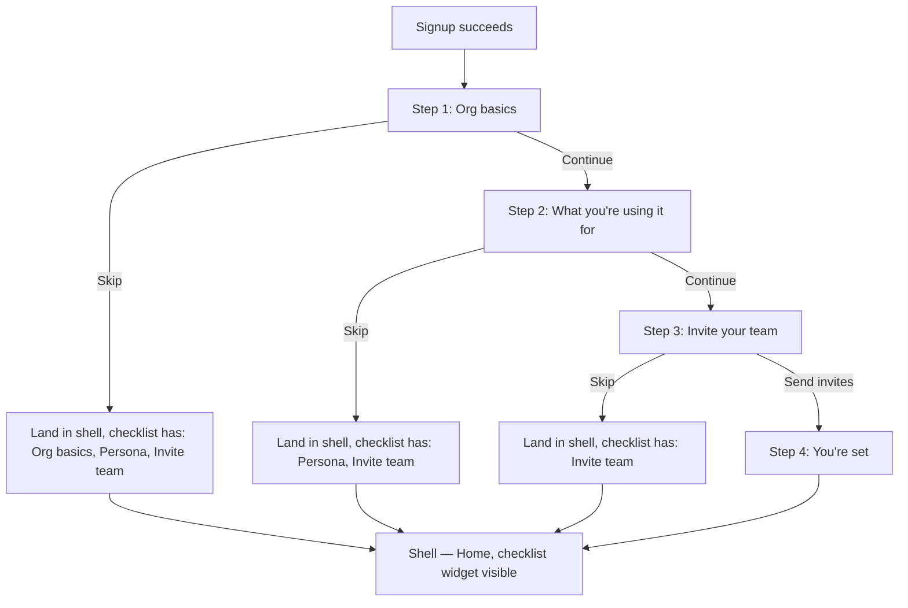
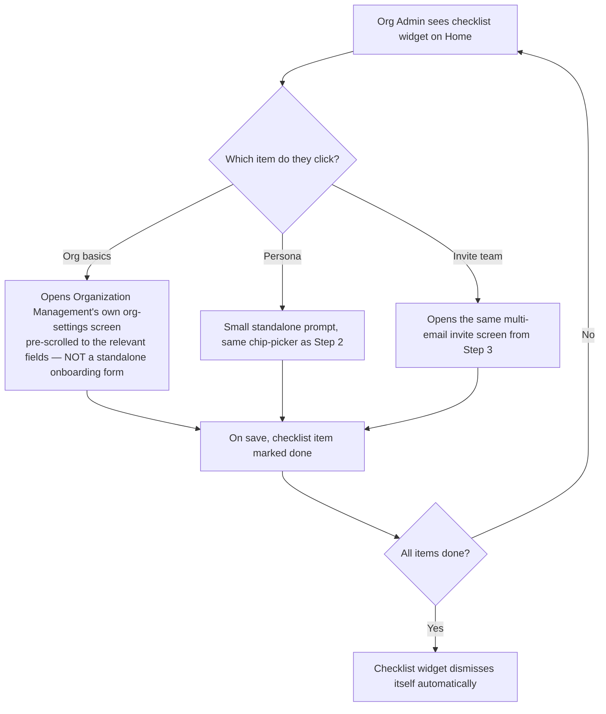
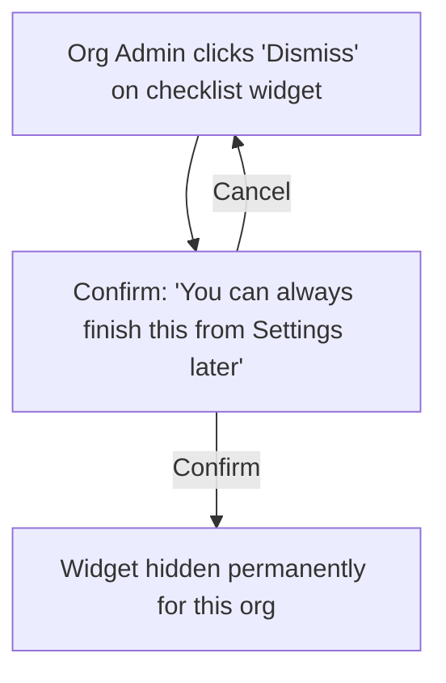

# Step 2 — User Flow — Onboarding

Turns [01-user-journey.md](01-user-journey.md) into concrete flows.

## Flow A — The wizard itself

- Every step's "skip" drops straight to the shell rather than advancing to the next step — skipping is an exit, not a fast-forward, since the remaining steps are better surfaced later via the checklist than forced through in one sitting.
- Only Step 4 has no skip — it's just a confirmation, there's nothing left to skip.

## Flow B — Resuming from the checklist

- Confirms the Step 1 journey note: re-opening "Org basics" from the checklist routes into the real Organization Management screens, not a onboarding-only duplicate.
- The checklist auto-dismissing once everything's done (vs. requiring a manual close) matters — an Org Admin who did everything shouldn't have a stale "finish setup" nag lingering.

## Flow C — Manual dismissal

- A lightweight confirm, not a full modal — this is a low-stakes action (nothing is deleted, just hidden), so a heavy confirmation would be overkill.

## Carried into Step 3 (Sitemap)

Four wizard-step screens + the checklist widget (a Dashboard-module component, referenced here but not owned by this module) + the dismiss-confirm micro-interaction.
