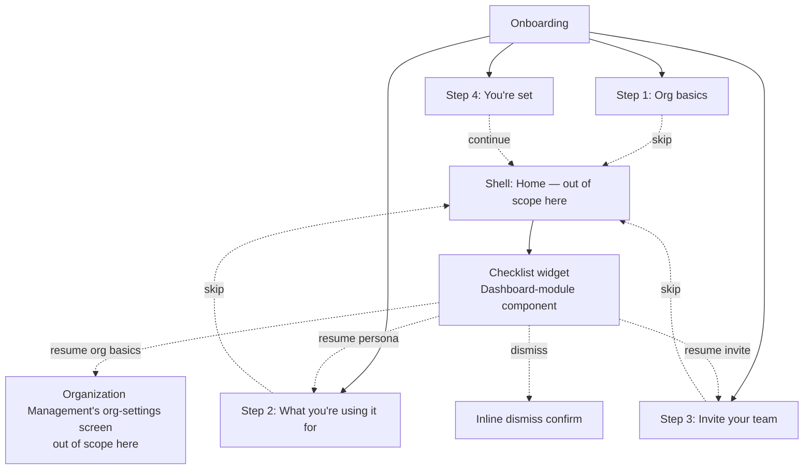

# Step 3 — Sitemap — Onboarding

## Notes

- **4 real screens** (the wizard steps) + **1 shared micro-interaction** (dismiss confirm). The checklist widget itself belongs to the Dashboard module's sitemap, not this one — Onboarding only defines what's *inside* it and where each item routes.
- No separate "resume org basics" screen — it deliberately routes into Organization Management rather than duplicating a form, per the Step 1 journey note.
- The wizard is a single connected sequence, not a set of independent screens — Step 4 is only reachable by completing (not skipping) Step 3.

## Carried into Step 4 (Wireframes)

4 wizard-step frames, sharing one stepper shell (progress indicator + skip action + primary continue action), plus a small checklist-widget sketch (even though it's owned by Dashboard) so the hand-off is visualized.
