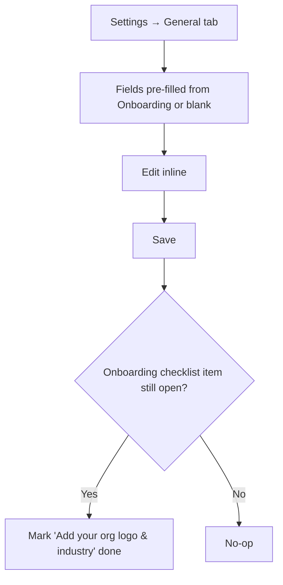
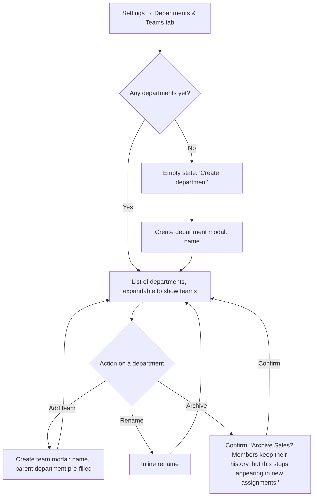

# Step 2 — User Flow — Organization Management

## Flow A — Settings: General

## Flow B — Departments & Teams

- Archive confirm explicitly states what stays intact (history) vs. what changes (no longer usable for new assignments) — a generic "Are you sure?" wouldn't communicate that this is non-destructive.
- Member counts shown per department/team are read-only here; clicking a count routes to User Management's filtered user list (out of scope for this module's own flow).

## Carried into Step 3 (Sitemap)

One Settings screen, two tabs (General, Departments & Teams), plus two small modals (Create department, Create team) and one shared archive-confirm pattern.
