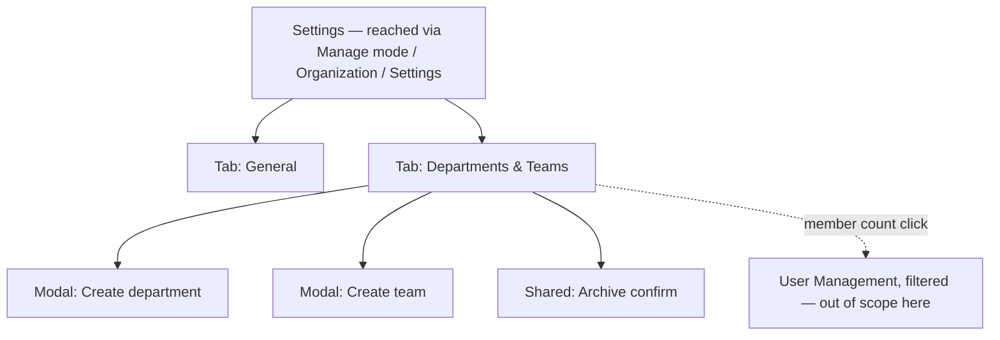

# Step 3 — Sitemap — Organization Management

## Notes

- **2 tabs + 2 modals + 1 shared confirm pattern** — deliberately small, matching the narrowed scope in [00-open-questions.md](00-open-questions.md).
- No standalone "Org Profile" page separate from Settings — General is just the first tab, consistent with how most SaaS settings areas work (Stripe, Vercel, Linear all use tabbed settings, not a maze of separate pages).

## Carried into Step 4 (Wireframes)

One Settings frame showing the General tab, one showing the Departments & Teams tab (with departments expanded to show teams and member counts), and the two small modals.
