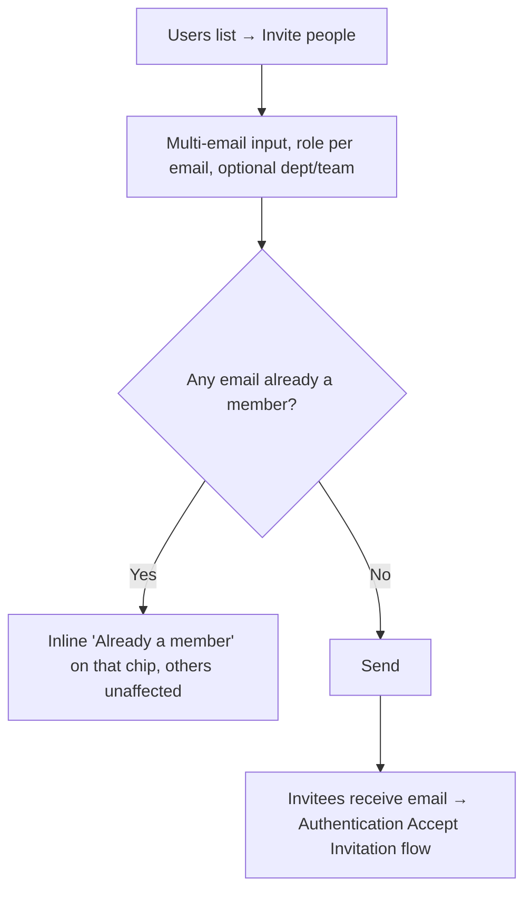
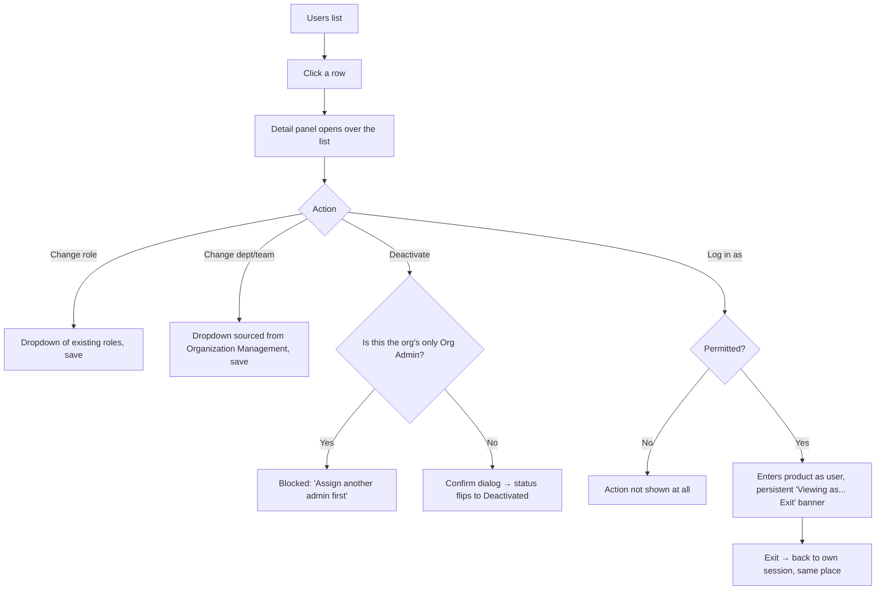
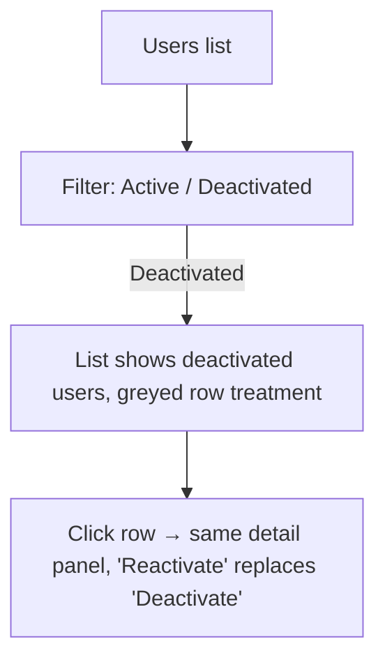

# Step 2 — User Flow — User Management

## Flow A — Invite people

## Flow B — Manage existing user

- "Log in as" not being shown at all (rather than shown-but-disabled) for unpermitted admins matches the same principle already established in the Shell module — absence over a disabled/locked control.

## Flow C — Deactivated view

## Carried into Step 3 (Sitemap)

One list screen (with an Active/Deactivated filter, not a separate screen), one detail panel, one invite modal, one deactivate-confirm, one blocked-state message, and the impersonation banner.
