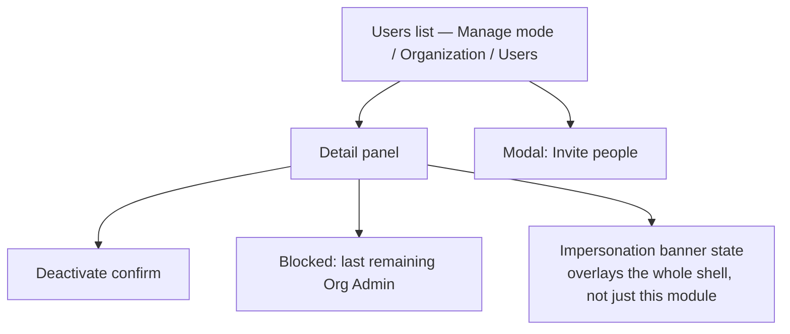

# Step 3 — Sitemap — User Management

## Notes

- **1 list + 1 panel + 1 modal + 2 small states + 1 cross-cutting banner** — the smallest module so far, intentionally, given the deferrals in [00-open-questions.md](00-open-questions.md).
- The impersonation banner technically belongs to the Shell's vocabulary (a persistent top strip, same family as the Offline banner already wireframed) more than to this module's own screens — noted here, drawn once in Step 4.

## Carried into Step 4 (Wireframes)

Users list (with filter tabs), detail panel, invite modal, deactivate confirm, blocked-state message, impersonation banner.
