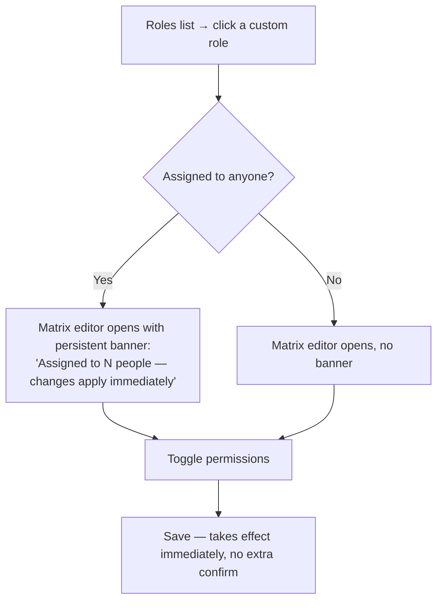
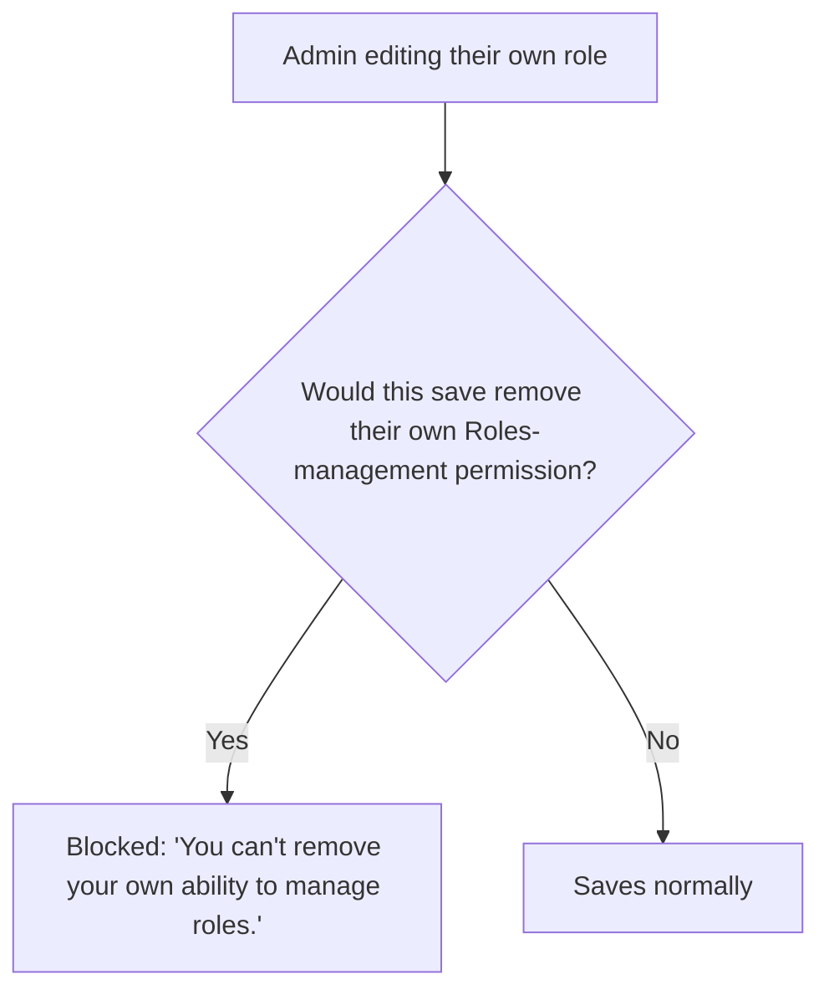
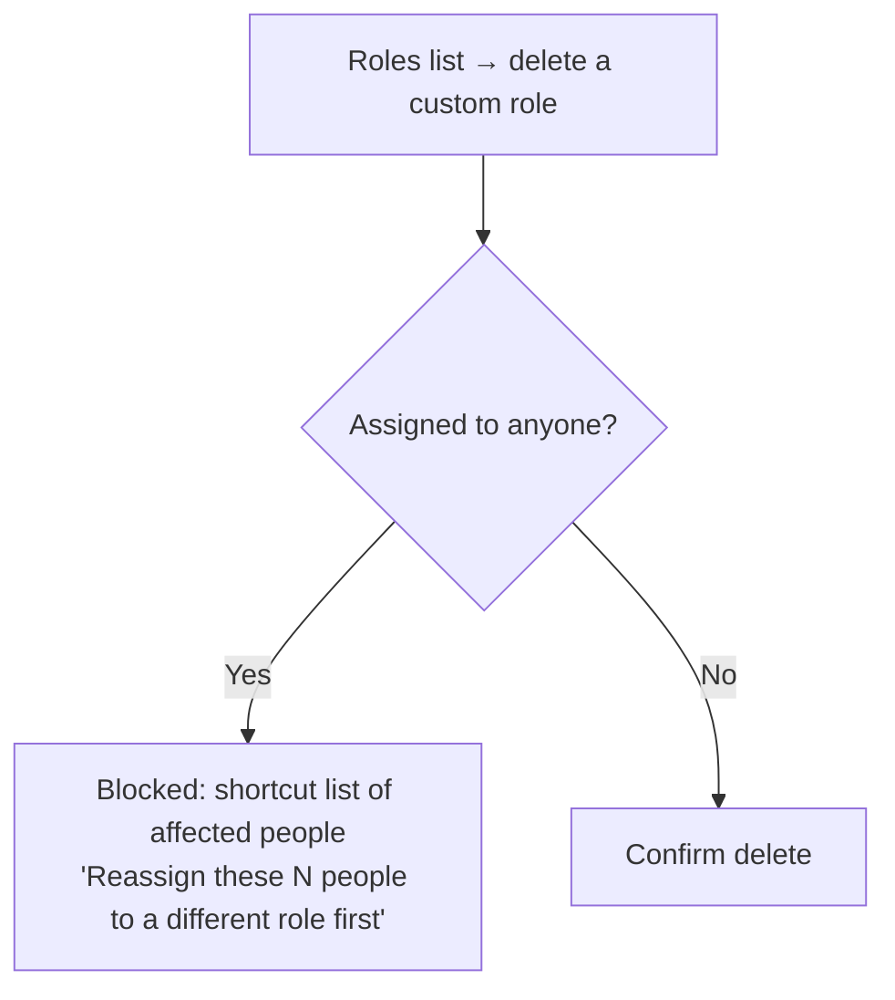

# Step 2 — User Flow — Roles & Permissions

## Flow A — Create a custom role

```mermaid
flowchart TD
    A[Roles list → Create role] --> B[Name + starting point:<br/>Clone from existing role (pre-selected) / Start blank]
    B --> C[Permission matrix editor opens for the new role]
    C --> D[Toggle permissions per category × action]
    D --> E[Save]
    E --> F[Role appears in list, assignable from User Management]
```

## Flow B — Edit a role in use



## Flow C — Self-lockout prevention



## Flow D — Delete a custom role



## Carried into Step 3 (Sitemap)

Roles list, permission matrix editor (shared by view and edit, view is just a read-only render of the same layout), create-role modal, and the two blocked-state messages.
