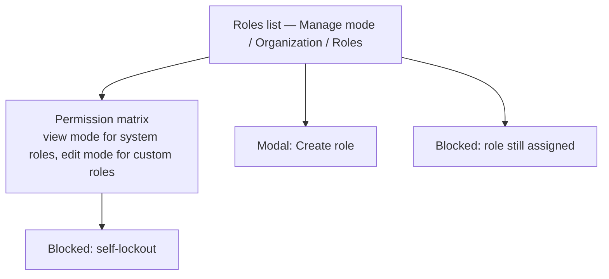

# Step 3 — Sitemap — Roles & Permissions

## Notes

- **1 list + 1 matrix (dual view/edit mode) + 1 modal + 2 blocked states** — same small footprint as User Management, deliberately.
- View and edit are the same screen, not two — a system role just renders the matrix with all controls disabled, so there's exactly one layout to design, not two nearly-identical ones.

## Carried into Step 4 (Wireframes)

Roles list, permission matrix (annotated to show both its view-only and editable states), create-role modal, both blocked states.
