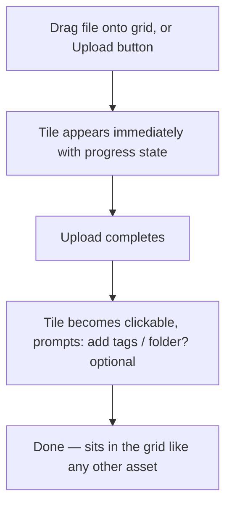
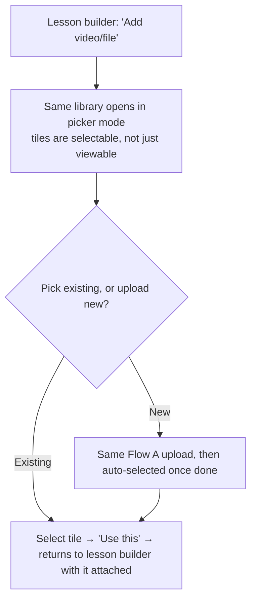
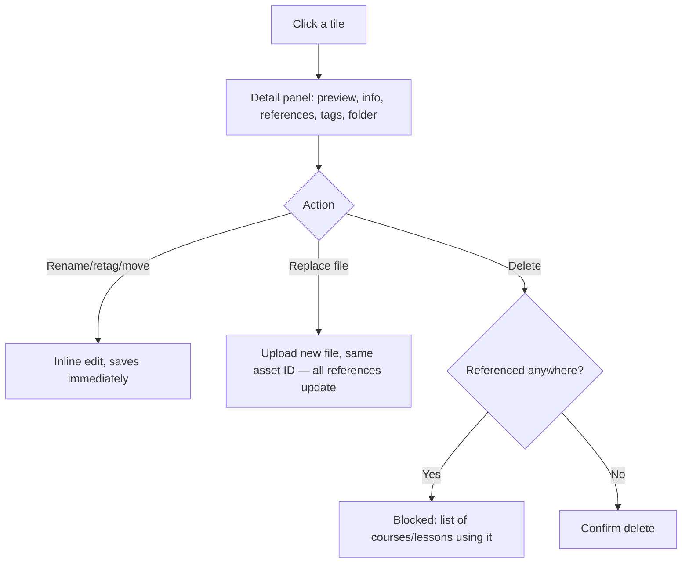

# Step 2 — User Flow — Content Library

## Flow A — Upload

## Flow B — Picker mode (launched from Lessons)

## Flow C — Manage / delete

## Carried into Step 3 (Sitemap)

Library grid (with folder/tag filters), detail panel, upload flow (shared by both entry points), delete-blocked state.
