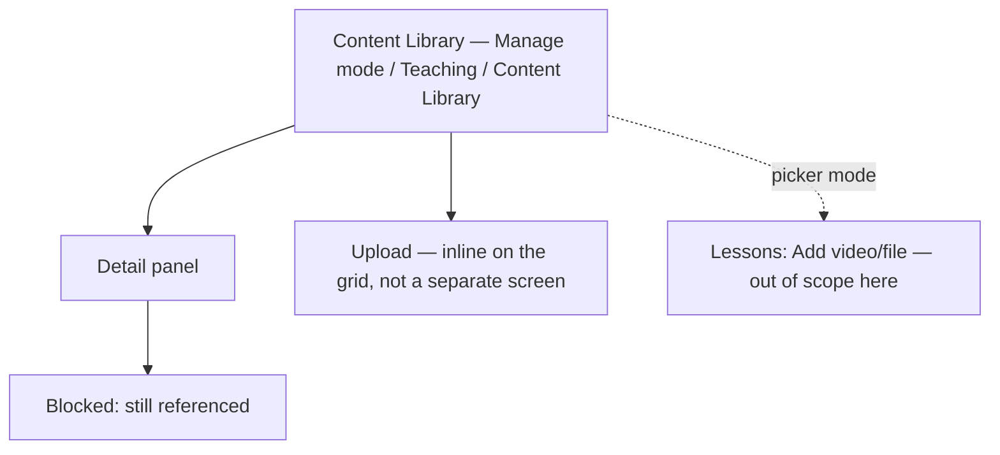

# Step 3 — Sitemap — Content Library

## Notes

- **1 grid + 1 detail panel + 1 inline upload state + 1 blocked state** — upload is deliberately not a separate screen; it happens directly on the grid tile, matching Journey 1's "no separate progress screen."
- Picker mode is a *mode* of this same grid (selectable tiles, a "Use this" action, entered from elsewhere), not a second, parallel screen to maintain.

## Carried into Step 4 (Wireframes)

Library grid (default mode), library grid (picker mode variant), detail panel, delete-blocked state.
