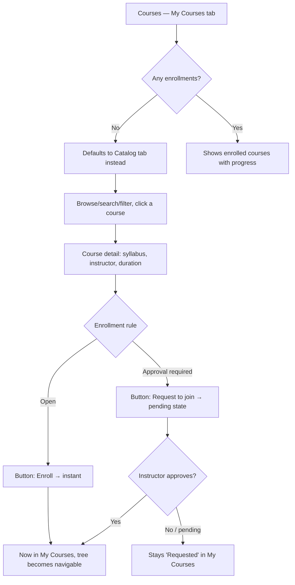
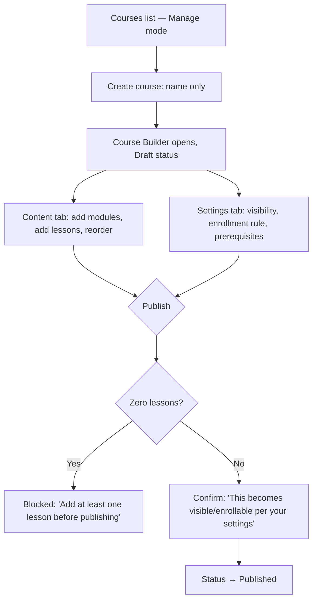
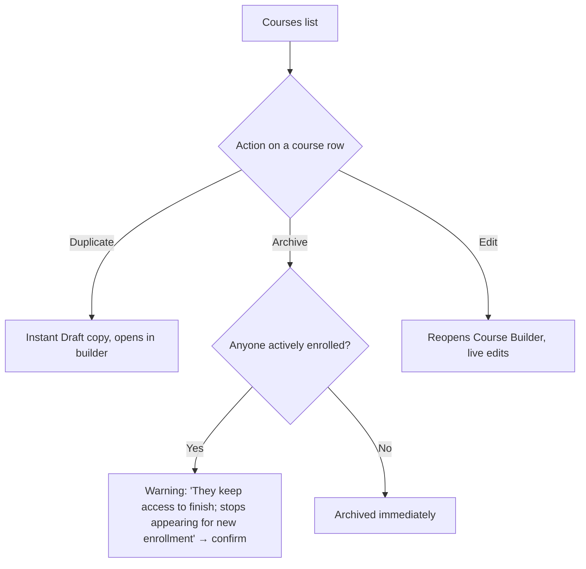
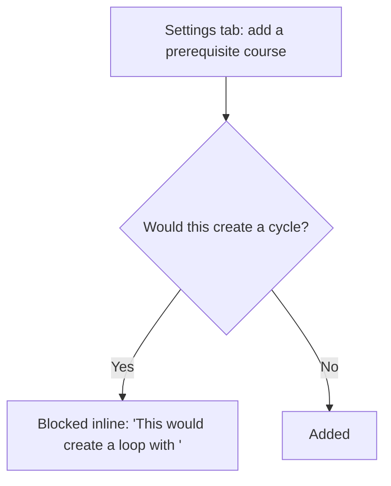

# Step 2 — User Flow — Courses

## Flow A — Learner: browse → enroll → progress

## Flow B — Instructor: create and build

## Flow C — Instructor: manage a live course

## Flow D — Prerequisite cycle guard

## Carried into Step 3 (Sitemap)

Courses (learner, tabbed), Course detail (dual-purpose: learner view / instructor preview), Courses list (instructor), Course Builder (2 tabs), create-course inline flow, publish-confirm, publish-blocked, archive-warning, cycle-guard.
