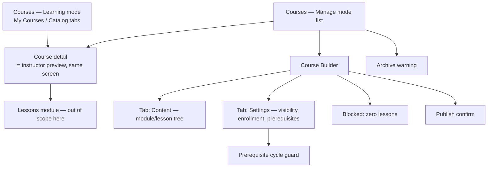

# Step 3 — Sitemap — Courses

## Notes

- **5 real screens** (Learner Courses, Course detail/preview, Instructor Courses list, Course Builder with its 2 tabs) **+ 4 inline states** — small for an XL-flagged module, deliberately, per the scope note in [00-open-questions.md](00-open-questions.md).
- Course detail doing double duty (learner view / instructor preview) is the single biggest scope-reduction lever here — worth remembering if a future pass finds instructors need meaningfully different information than learners see.

## Carried into Step 4 (Wireframes)

Learner Courses (both tab states), Course detail, Instructor Courses list, Course Builder (Content tab), Course Builder (Settings tab), the 4 inline states.
