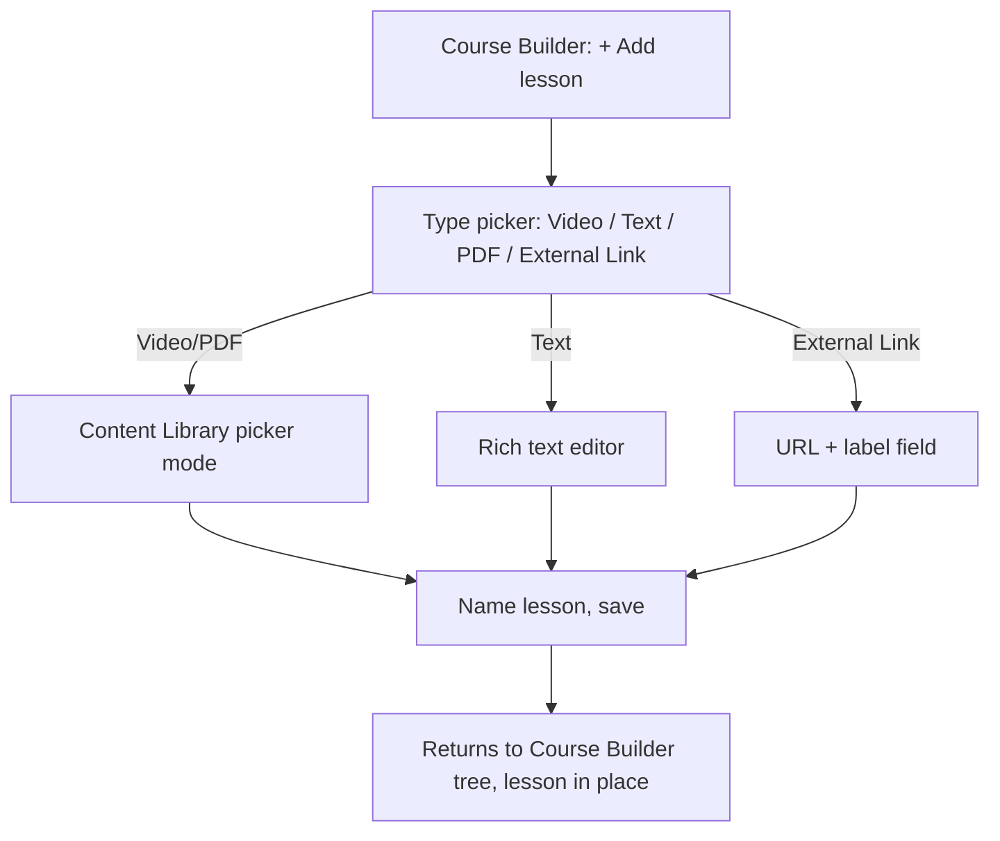
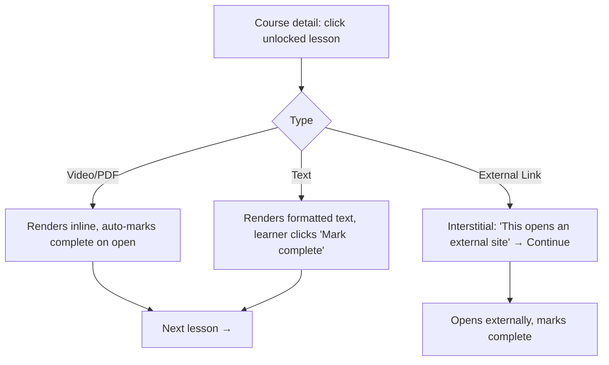

# Step 2 — User Flow — Lessons

## Flow A — Instructor adds a lesson

## Flow B — Learner views a lesson

## Carried into Step 3 (Sitemap)

Type picker, 3 editor variants (Content Library picker reused for Video/PDF, Text editor, External Link form), lesson viewer (per-type rendering + external-link interstitial).
