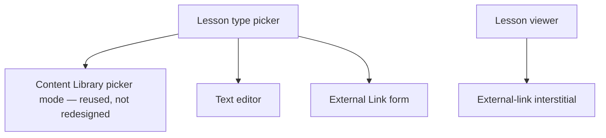

# Step 3 — Sitemap — Lessons

## Notes

- **1 shared picker + 3 editor bodies (one reused wholesale) + 1 viewer (4 render variants) + 1 interstitial** — small module, most of its apparent complexity absorbed by reusing Content Library rather than rebuilding upload/browse.

## Carried into Step 4 (Wireframes)

Type picker, Text editor, External Link form, lesson viewer (video/PDF/text render states), external-link interstitial. (Video/PDF picker itself is already wireframed in Content Library — not redrawn.)
