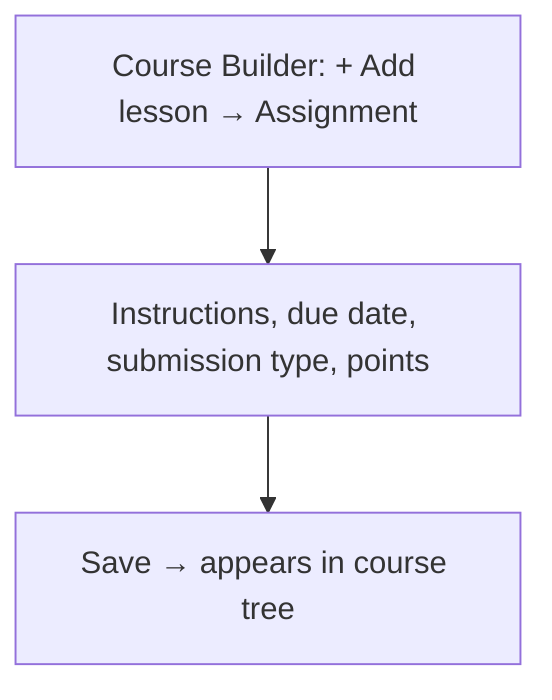
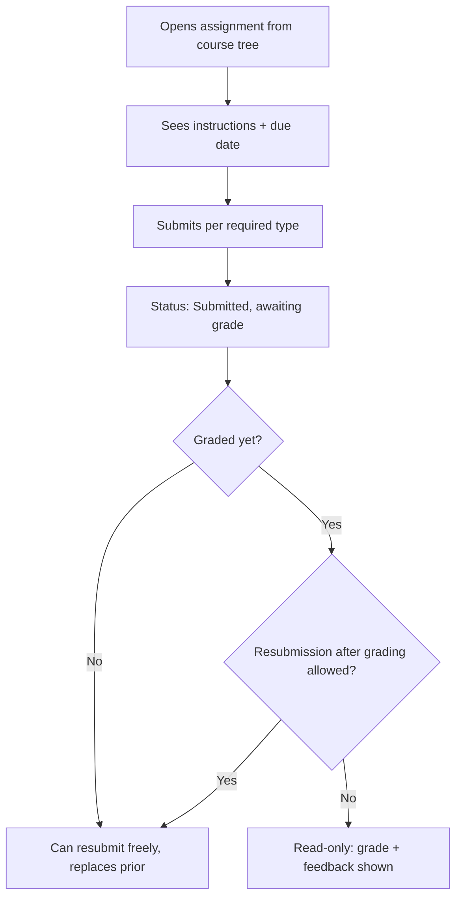
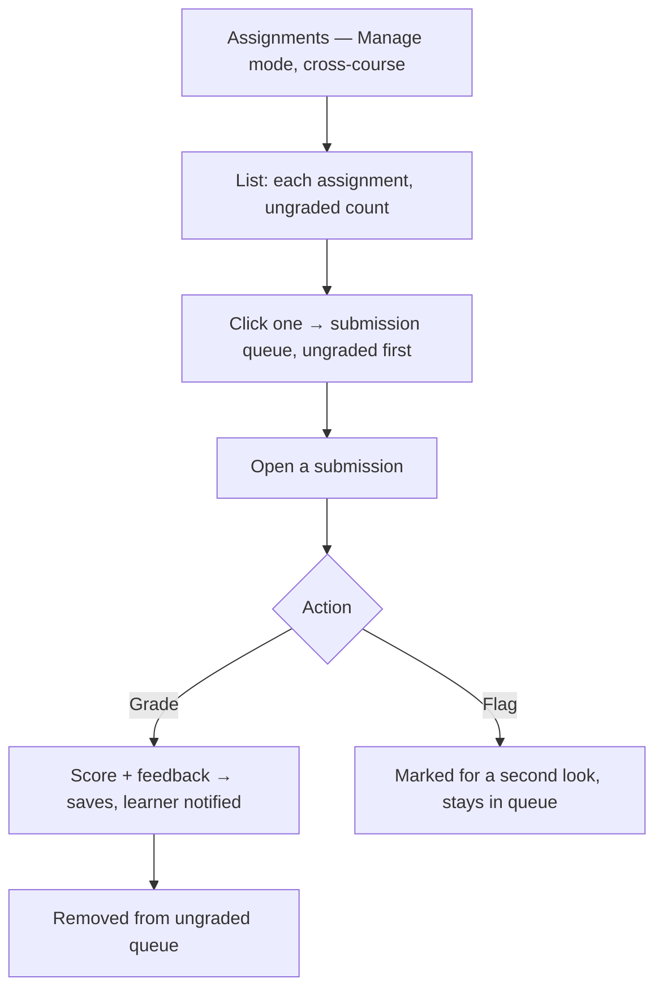

# Step 2 — User Flow — Assignments

## Flow A — Create

## Flow B — Learner submits

## Flow C — Instructor grades

## Carried into Step 3 (Sitemap)

Assignment editor (extends the Lesson text-editor pattern), learner submission screen, Assignments list (cross-course), submission queue, grading view.
