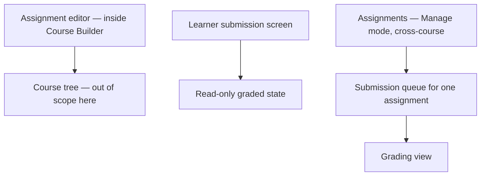

# Step 3 — Sitemap — Assignments

## Notes

- **1 editor (extends Lessons' text editor) + 1 learner screen (with a read-only variant) + 1 cross-course list + 1 queue + 1 grading view** — again small, most complexity absorbed by reusing the Lesson editor pattern rather than building a parallel one.

## Carried into Step 4 (Wireframes)

Assignment editor, learner submission screen (both submit and read-only-graded states), Assignments list, submission queue, grading view.
