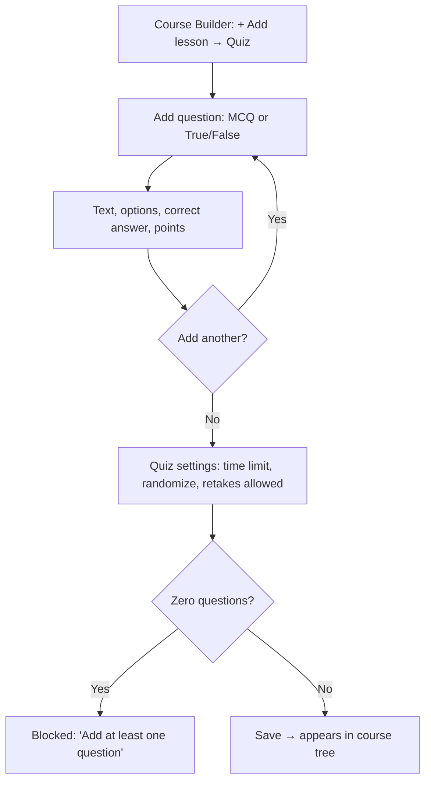
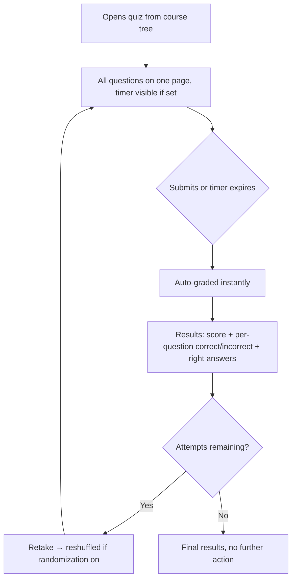

# Step 2 — User Flow — Quizzes

## Flow A — Instructor builds

## Flow B — Learner takes and retakes

## Carried into Step 3 (Sitemap)

Quiz editor (question list + add-question form + settings), quiz-taking screen, results screen (with retake state).
