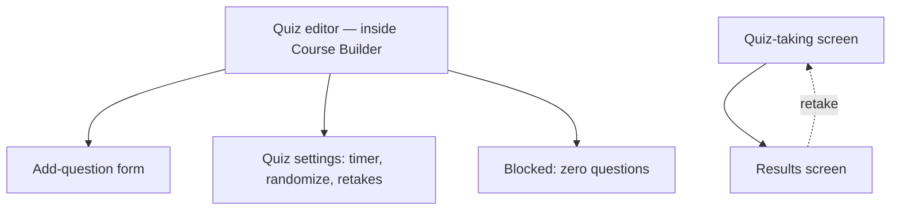

# Step 3 — Sitemap — Quizzes

## Notes

- **1 editor (with an inline add-question form and settings section) + 1 taking screen + 1 results screen (dual state: retake available / final)** — the smallest Phase-1 module so far, entirely because auto-grading removes the need for anything like Assignments' grading queue.

## Carried into Step 4 (Wireframes)

Quiz editor, add-question form (MCQ variant shown, True/False is a simplified version of the same form), quiz-taking screen, results screen (both states).
