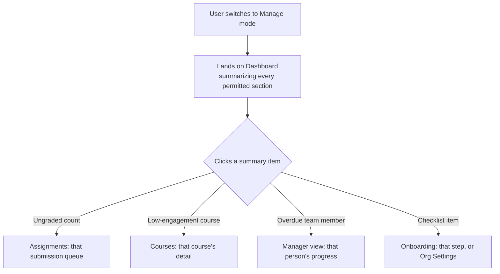
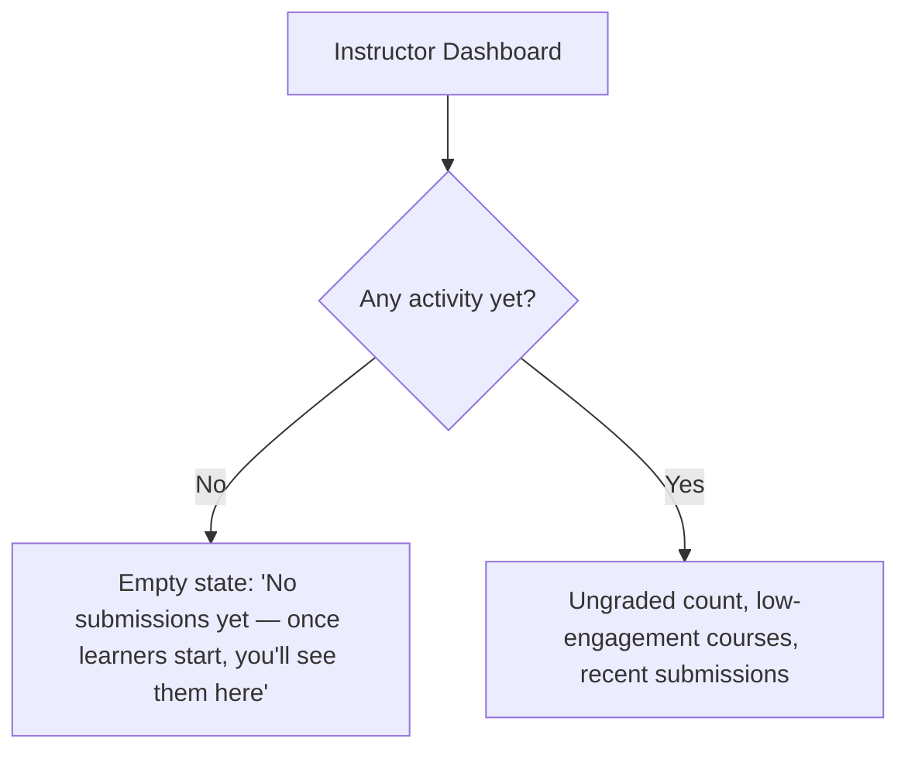
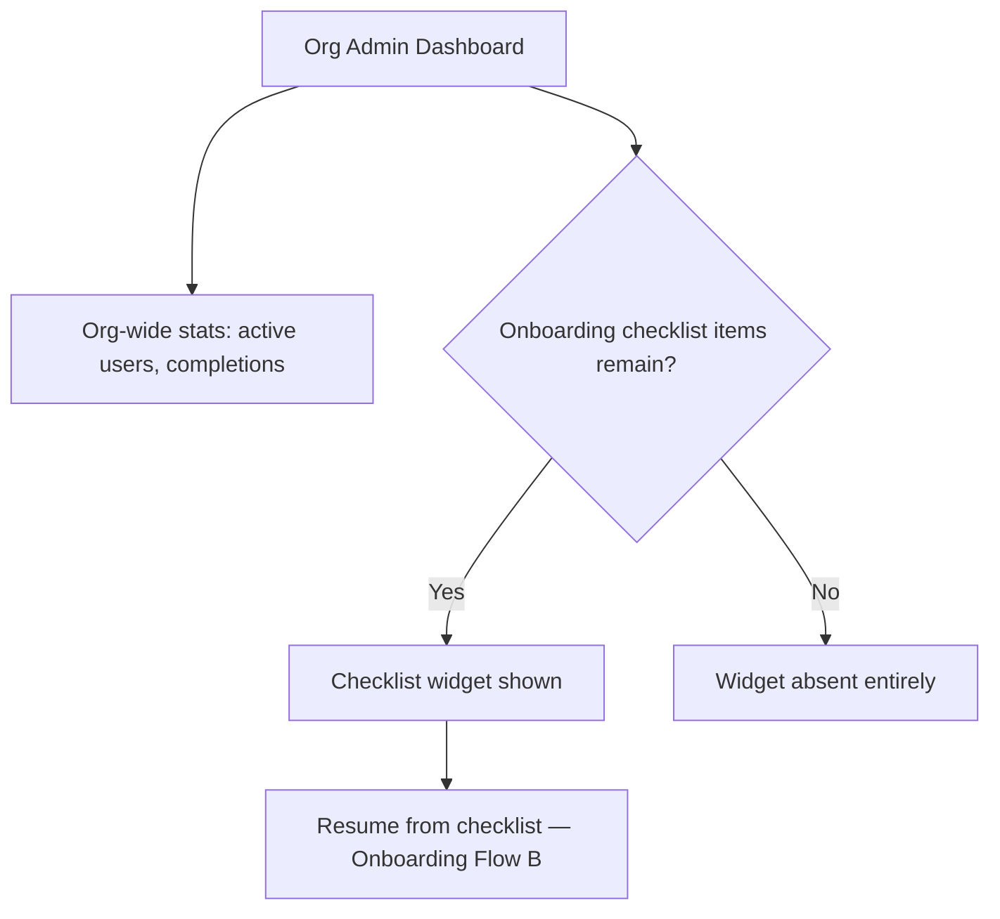

# Step 2 — User Flow — Dashboard

## Flow A — Manage-mode landing (refined)

## Flow B — Instructor dashboard states

## Flow C — Org Admin dashboard + checklist

## Carried into Step 3 (Sitemap)

Instructor Dashboard (with empty state), Manager Dashboard (with empty state), Org Admin Dashboard (with/without checklist widget). Learner Dashboard already sited in the Shell module's sitemap — referenced, not re-listed.
