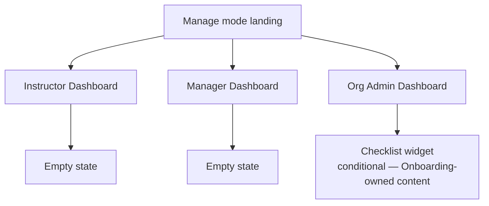

# Step 3 — Sitemap — Dashboard

## Notes

- **3 new dashboards + 2 empty states + 1 already-designed widget slotted in** — the Learner Dashboard (Shell's Home) isn't re-listed since it's already fully sited there.
- A multi-role account sees these stacked on one page (per Journey 4), not as separate screens to navigate between — so "3 dashboards" means 3 possible *sections* of one landing page, not 3 mutually exclusive routes.

## Carried into Step 4 (Wireframes)

Instructor Dashboard (populated + empty), Manager Dashboard (populated + empty), Org Admin Dashboard (with checklist, without checklist).
