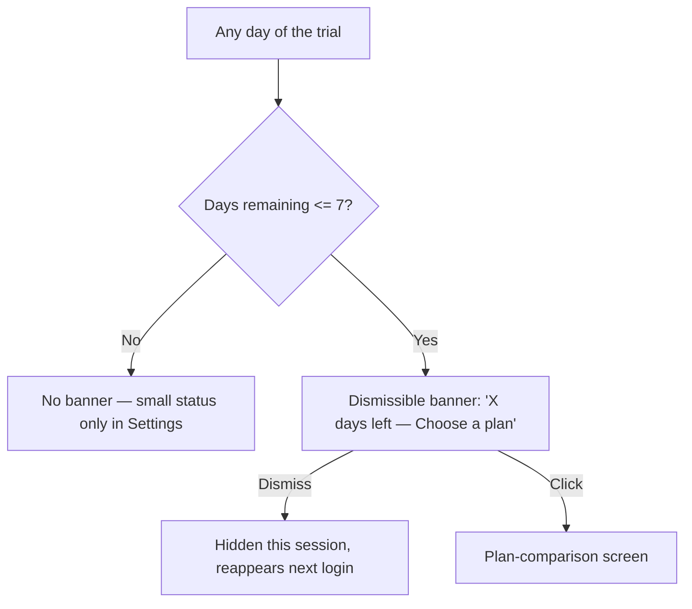
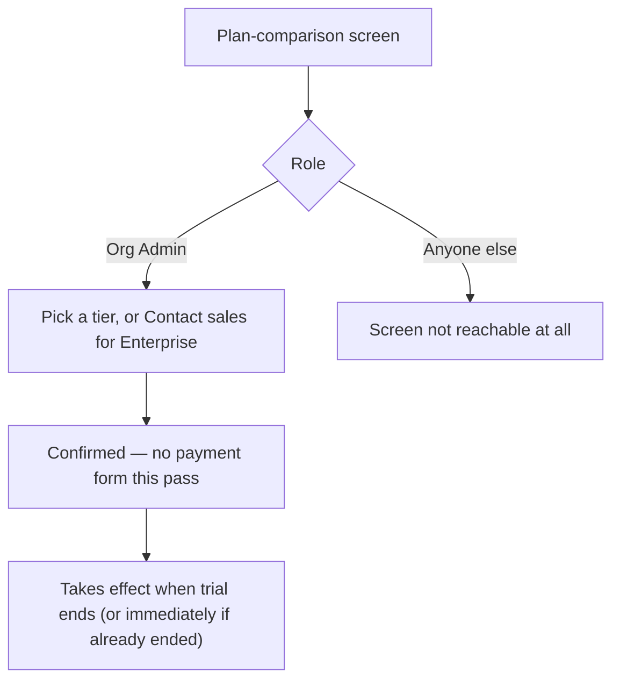
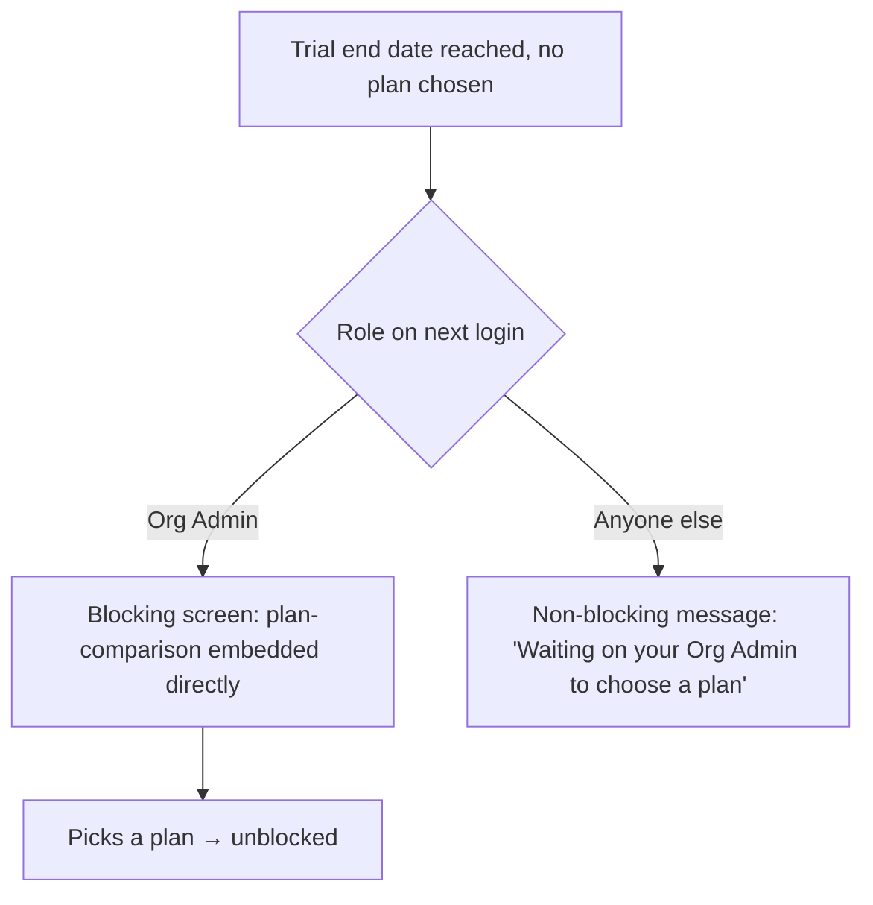

# Step 2 — User Flow — Trial & Plan

## Flow A — Trial countdown and banner

## Flow B — Choosing a plan

## Flow C — Trial expires with no plan chosen

## Carried into Step 3 (Sitemap)

Trial status indicator (Settings), trial-ending banner, plan-comparison screen (used in 3 contexts), trial-expired blocking screen (Org Admin), trial-expired message (everyone else).
