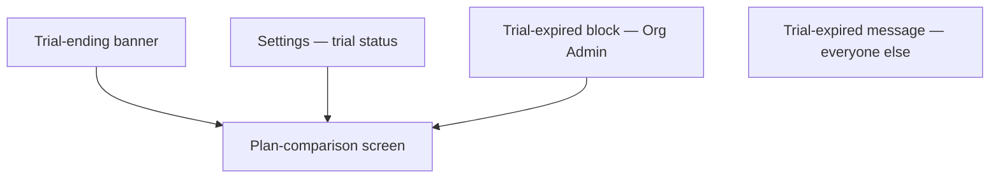

# Step 3 — Sitemap — Trial & Plan

## Notes

- **1 shared plan-comparison screen reached 3 ways + 1 status indicator + 2 expired-state variants (by role)** — the smallest module in Phase 1, on purpose, given payment collection is explicitly out of scope.

## Carried into Step 4 (Wireframes)

Trial status (in Settings), trial-ending banner, plan-comparison screen, trial-expired block (Org Admin), trial-expired message (everyone else).
