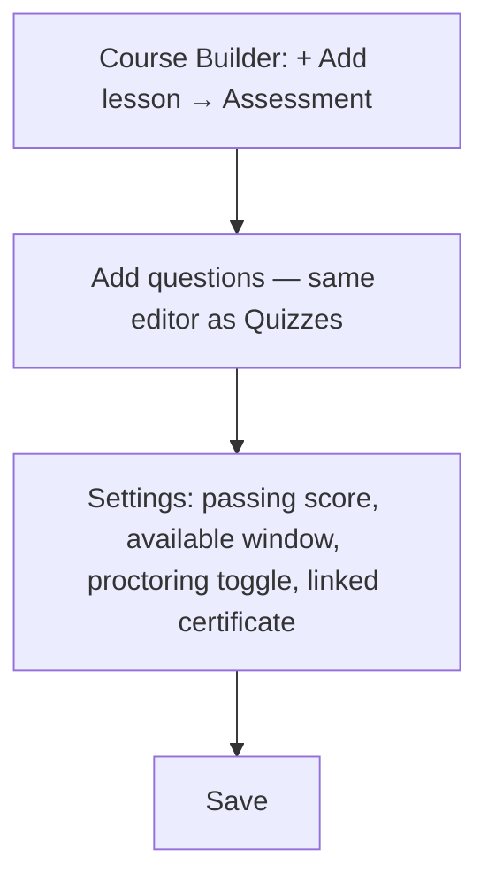
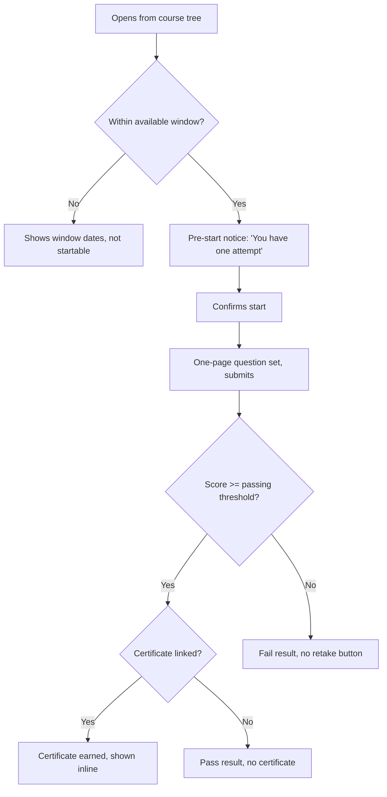

# Step 2 — User Flow — Assessments

## Flow A — Instructor builds

## Flow B — Learner takes once

## Carried into Step 3 (Sitemap)

Assessment editor (extends Quiz editor), pre-start notice, taking screen (reuses Quiz-taking layout), result screen (pass-with-certificate / pass-without / fail variants), not-yet-available state.
