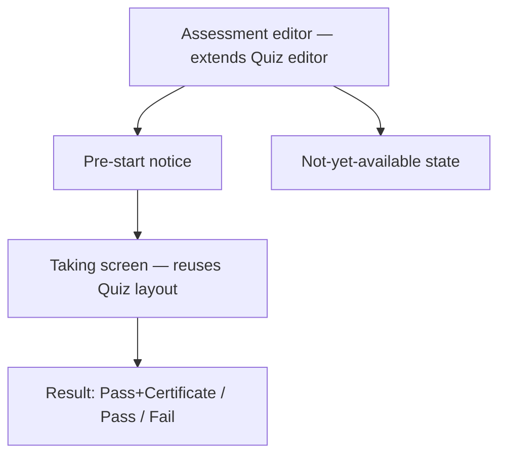

# Step 3 — Sitemap — Assessments

## Notes

- **Almost entirely reused from Quizzes** — the only genuinely new screens are the pre-start notice and the not-available state; the editor and taking screen are the same layouts with different settings/copy.

## Carried into Step 4 (Wireframes)

Assessment editor (settings section only — question editing is identical to Quizzes, not redrawn), pre-start notice, not-available state, result screen (3 variants).
