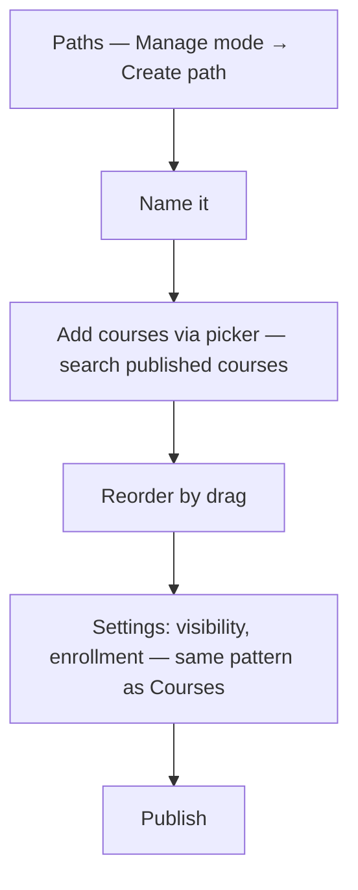
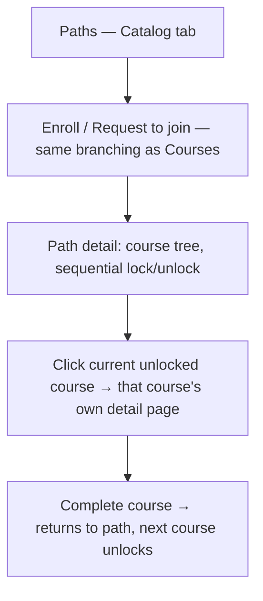

# Step 2 — User Flow — Learning Paths

## Flow A — Build a path

## Flow B — Learner follows

## Carried into Step 3 (Sitemap)

Paths list (instructor), Path Builder, course picker, Paths (learner, tabbed), Path detail.
