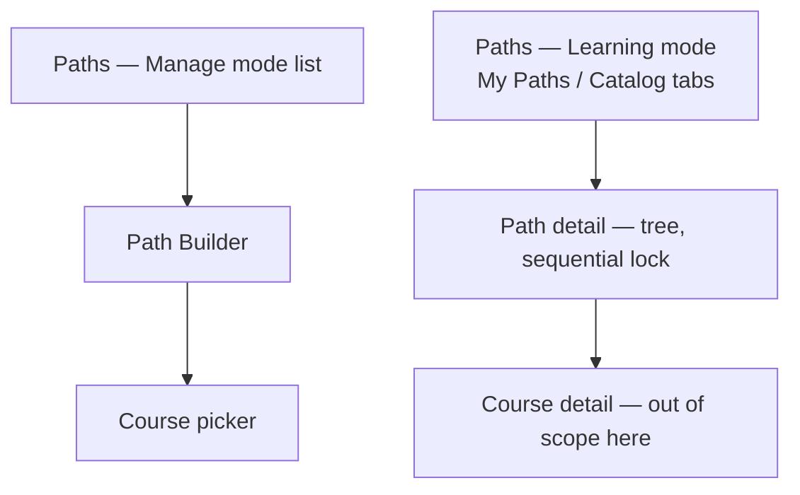

# Step 3 — Sitemap — Learning Paths

## Notes

- **2 lists (instructor/learner) + 1 builder + 1 picker + 1 detail screen** — small, since almost every visual pattern (tabs, tree-with-locking, picker) is reused from Courses rather than invented fresh.

## Carried into Step 4 (Wireframes)

Paths list (instructor), Path Builder, course picker modal, Paths (learner, both tabs), Path detail.
