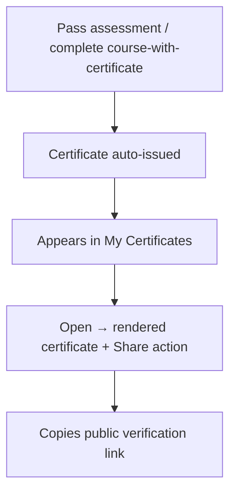
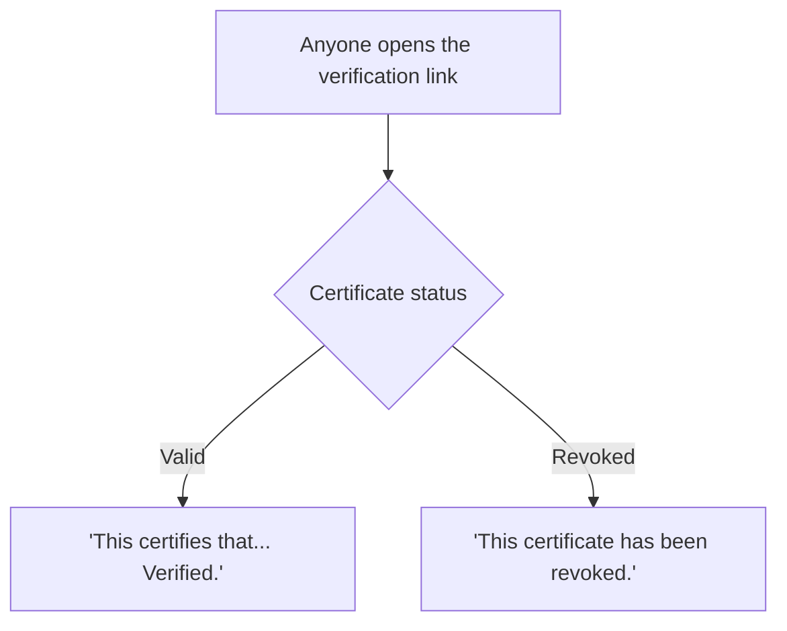
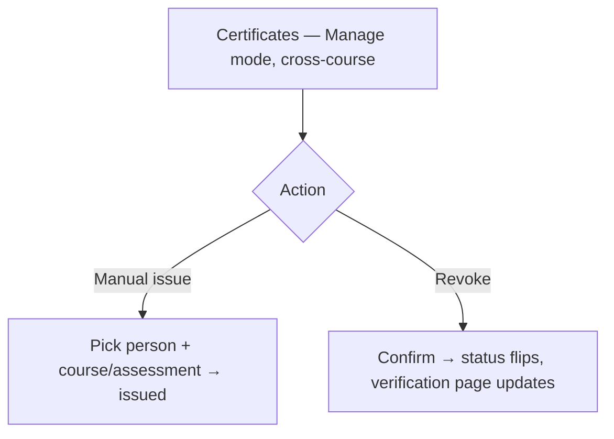

# Step 2 — User Flow — Certificates

## Flow A — Earn and view

## Flow B — Public verification

## Flow C — Admin oversight

## Carried into Step 3 (Sitemap)

My Certificates (learner), certificate detail/view, public verification page (valid + revoked states), Certificates list (admin, cross-course), manual-issue flow, revoke confirm.
