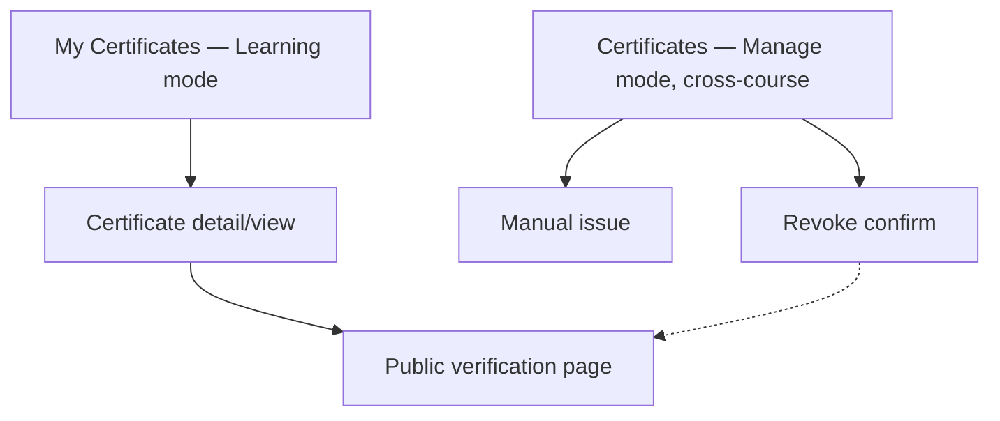

# Step 3 — Sitemap — Certificates

## Notes

- **1 learner list + 1 detail/view + 1 public page (2 states) + 1 admin list + 2 small admin actions** — small module, and the public verification page is the one screen here that's genuinely novel (no-login, external-facing — unlike almost everything else designed so far).

## Carried into Step 4 (Wireframes)

My Certificates, certificate detail, public verification page (valid + revoked), Certificates admin list, manual-issue modal, revoke confirm.
