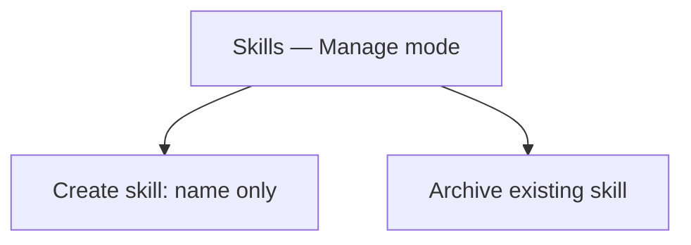
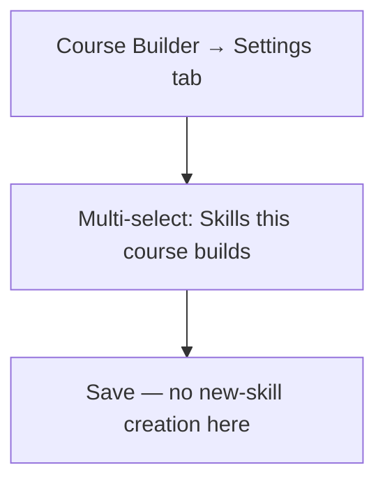
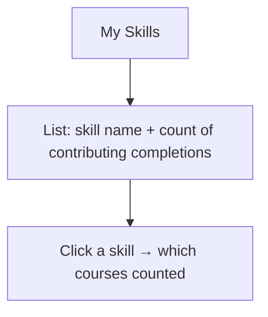

# Step 2 — User Flow — Skills

## Flow A — Admin manages taxonomy

## Flow B — Instructor tags a course

## Flow C — Learner views skills

## Carried into Step 3 (Sitemap)

Skills taxonomy list (admin), course-settings addition (not a new screen), My Skills (learner), skill detail (contributing courses).
