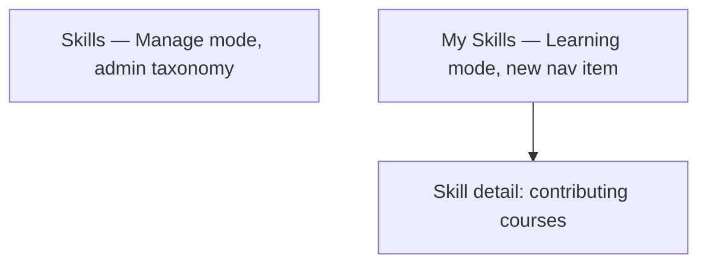

# Step 3 — Sitemap — Skills

## Notes

- **1 admin list + 1 learner list + 1 detail view** — the course-tagging addition lives inside Courses' existing Settings tab, not a new sitemap node here.
- Genuinely the smallest module designed so far.

## Carried into Step 4 (Wireframes)

Skills admin list, My Skills, skill detail.
