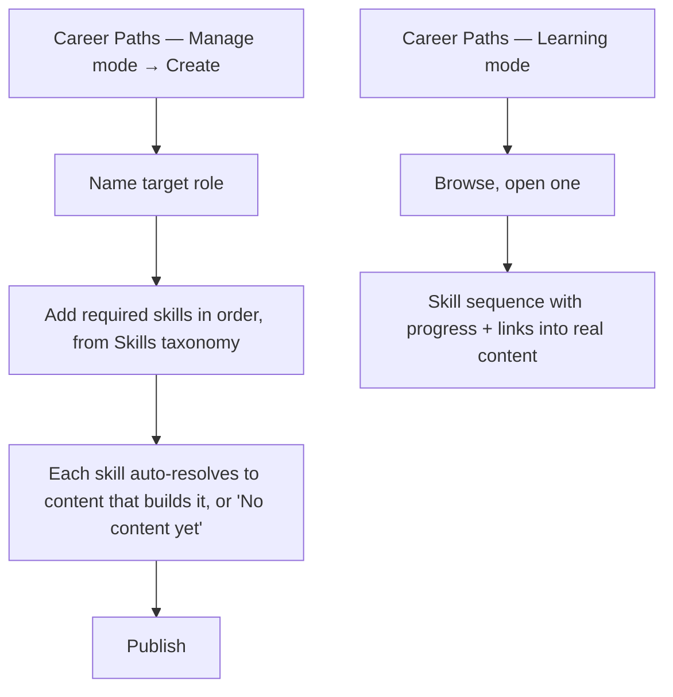

# Step 2 — User Flow — Career Paths

```mermaid
flowchart TD
    A[Career Paths — Manage mode → Create] --> B[Name target role]
    B --> C[Add required skills in order, from Skills taxonomy]
    C --> D[Each skill auto-resolves to content that builds it, or 'No content yet']
    D --> E[Publish]

    F[Career Paths — Learning mode] --> G[Browse, open one]
    G --> H[Skill sequence with progress + links into real content]
```

## Carried into Step 3 (Sitemap)

Career Paths list (admin), builder, Career Paths (learner list), path detail/explorer.
