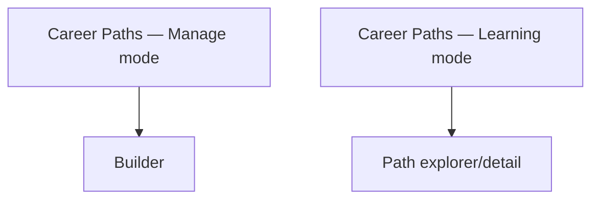

# Step 3 — Sitemap — Career Paths

Smallest module so far — 2 lists + 1 builder + 1 explorer, everything else reused from Skills and Learning Paths.

## Carried into Step 4 (Wireframes)

Admin list, builder, learner list, explorer.
