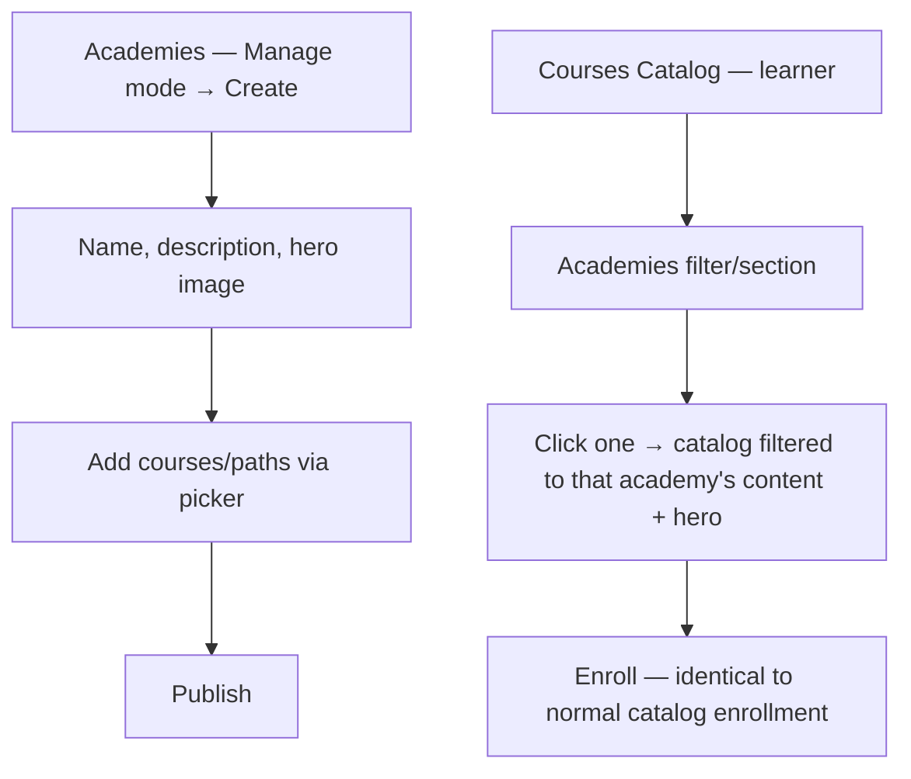

# Step 2 — User Flow — Academies

```mermaid
flowchart TD
    A[Academies — Manage mode → Create] --> B[Name, description, hero image]
    B --> C[Add courses/paths via picker]
    C --> D[Publish]

    E[Courses Catalog — learner] --> F[Academies filter/section]
    F --> G[Click one → catalog filtered to that academy's content + hero]
    G --> H[Enroll — identical to normal catalog enrollment]
```

## Carried into Step 3 (Sitemap)

Academies list (admin), builder, Catalog's academy filter view (a state of the existing Courses Catalog, not a new screen).
