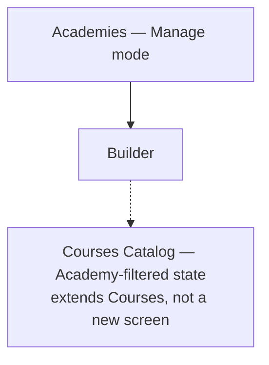

# Step 3 — Sitemap — Academies

Smallest module yet — 1 admin list + 1 builder, everything learner-facing is a state of a screen [Courses](../07-courses/) already owns.

## Carried into Step 4 (Wireframes)

Admin list, builder, Catalog academy-filtered state.
