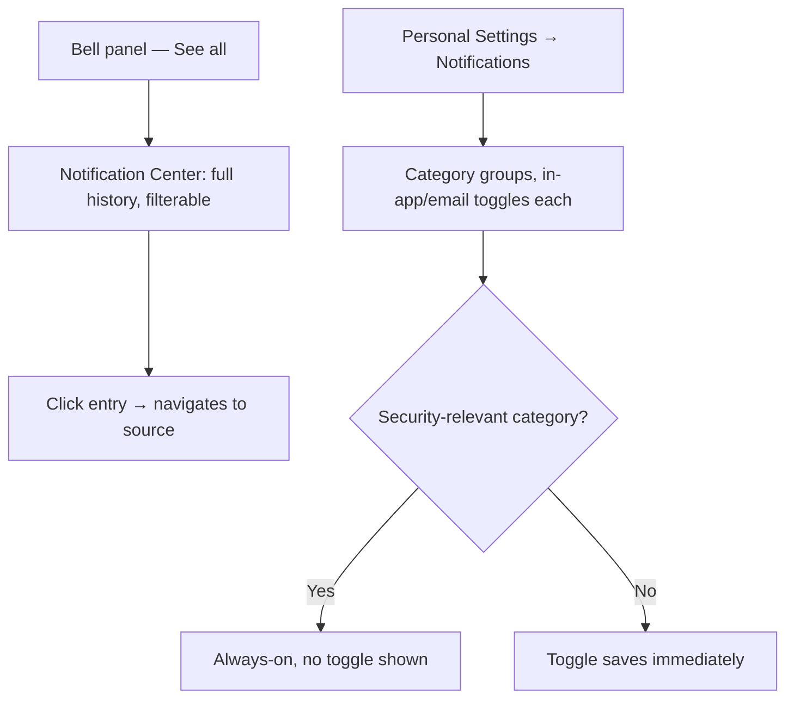

# Step 2 — User Flow — Notifications

```mermaid
flowchart TD
    A[Bell panel — See all] --> B[Notification Center: full history, filterable]
    B --> C[Click entry → navigates to source]

    D[Personal Settings → Notifications] --> E[Category groups, in-app/email toggles each]
    E --> F{Security-relevant category?}
    F -- Yes --> G[Always-on, no toggle shown]
    F -- No --> H[Toggle saves immediately]
```

## Carried into Step 3 (Sitemap)

Notification Center, Notification Preferences.
