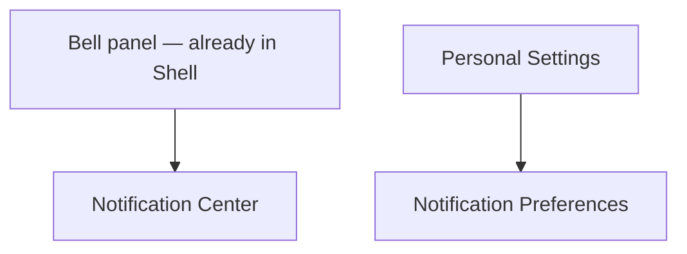

# Step 3 — Sitemap — Notifications

Two screens, both extending things designed elsewhere (Shell's bell, Settings' personal area).

## Carried into Step 4 (Wireframes)

Notification Center, Notification Preferences.
