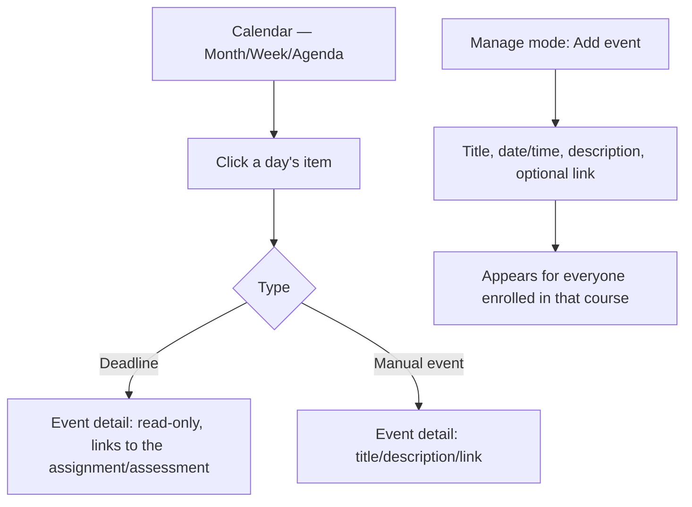

# Step 2 — User Flow — Calendar

```mermaid
flowchart TD
    A[Calendar — Month/Week/Agenda] --> B[Click a day's item]
    B --> C{Type}
    C -- Deadline --> D[Event detail: read-only, links to the assignment/assessment]
    C -- Manual event --> E[Event detail: title/description/link]

    F[Manage mode: Add event] --> G[Title, date/time, description, optional link]
    G --> H[Appears for everyone enrolled in that course]
```

## Carried into Step 3 (Sitemap)

Calendar (3 view states), event detail (2 variants: deadline read-only, manual event editable), add-event form.
