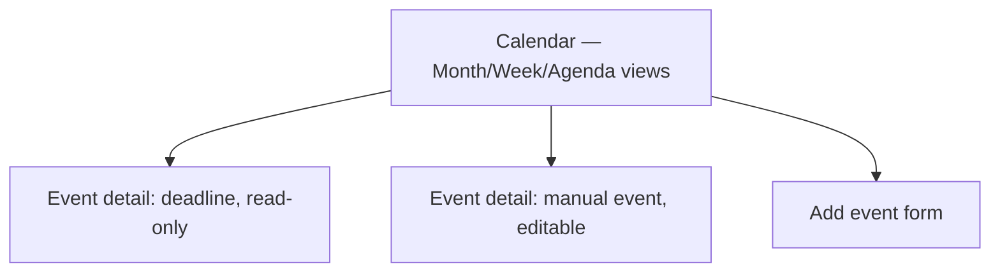

# Step 3 — Sitemap — Calendar

## Carried into Step 4 (Wireframes)

Calendar (month view — the other two view toggles are layout variants, not redrawn), event detail (both variants), add-event form.
