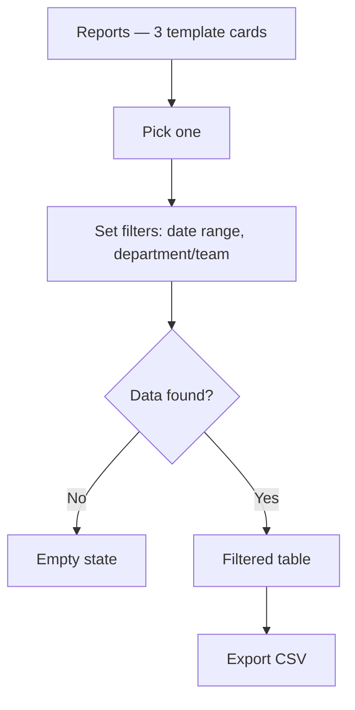

# Step 2 — User Flow — Reports

```mermaid
flowchart TD
    A[Reports — 3 template cards] --> B[Pick one]
    B --> C[Set filters: date range, department/team]
    C --> D{Data found?}
    D -- No --> E[Empty state]
    D -- Yes --> F[Filtered table]
    F --> G[Export CSV]
```

## Carried into Step 3 (Sitemap)

Reports list, report view (shared shape, 3 template variants), empty state.
