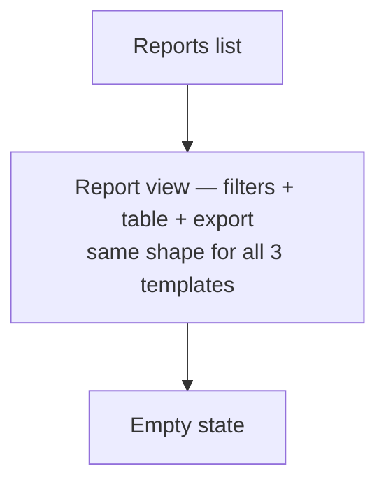

# Step 3 — Sitemap — Reports

## Carried into Step 4 (Wireframes)

Reports list, report view (Completion template shown — Engagement/Compliance are the same layout with different columns), empty state.
