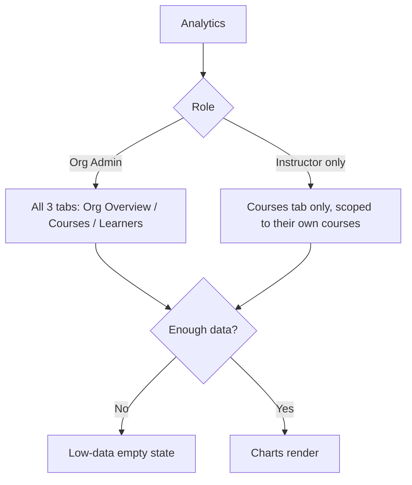

# Step 2 — User Flow — Analytics

```mermaid
flowchart TD
    A[Analytics] --> B{Role}
    B -- Org Admin --> C[All 3 tabs: Org Overview / Courses / Learners]
    B -- Instructor only --> D[Courses tab only, scoped to their own courses]
    C --> E{Enough data?}
    D --> E
    E -- No --> F[Low-data empty state]
    E -- Yes --> G[Charts render]
```

## Carried into Step 3 (Sitemap)

Analytics (3 tabs), low-data state.
