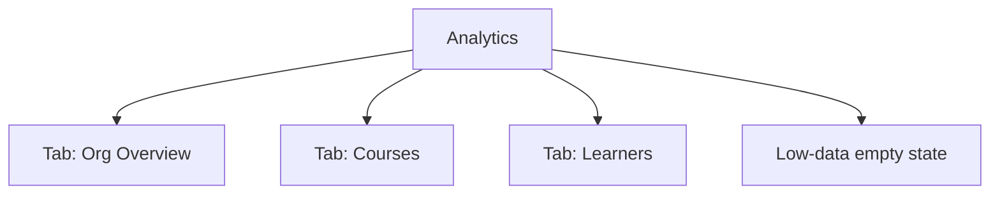

# Step 3 — Sitemap — Analytics

One screen, 3 tabs, 1 shared empty state — smallest possible footprint for what's normally a sprawling module.

## Carried into Step 4 (Wireframes)

Org Overview tab, Courses tab, Learners tab, low-data state.
