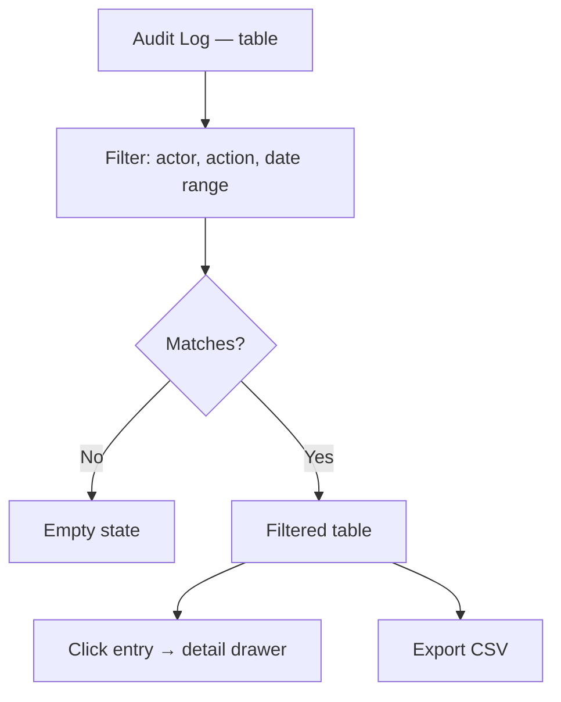

# Step 2 — User Flow — Audit Logs

```mermaid
flowchart TD
    A[Audit Log — table] --> B[Filter: actor, action, date range]
    B --> C{Matches?}
    C -- No --> D[Empty state]
    C -- Yes --> E[Filtered table]
    E --> F[Click entry → detail drawer]
    E --> G[Export CSV]
```

## Carried into Step 3 (Sitemap)

Audit Log viewer, detail drawer, empty state.
