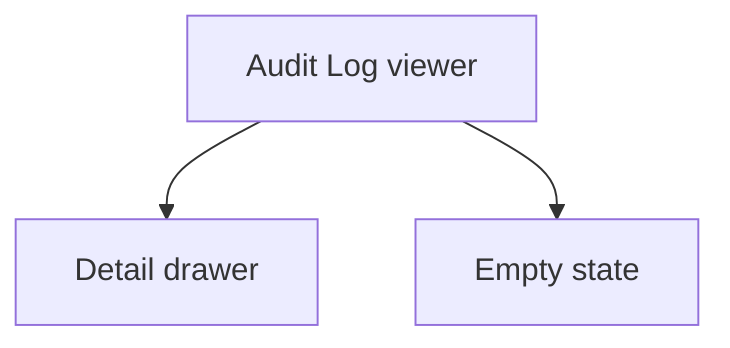

# Step 3 — Sitemap — Audit Logs

```mermaid
flowchart TD
    Viewer[Audit Log viewer] --> Detail[Detail drawer]
    Viewer --> Empty[Empty state]
```

Smallest module in the phase — 1 list + 1 drawer + 1 empty state.

## Carried into Step 4 (Wireframes)

Audit Log viewer, detail drawer.
