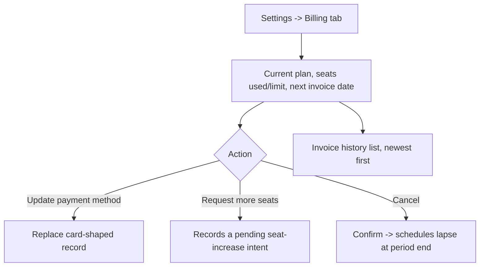
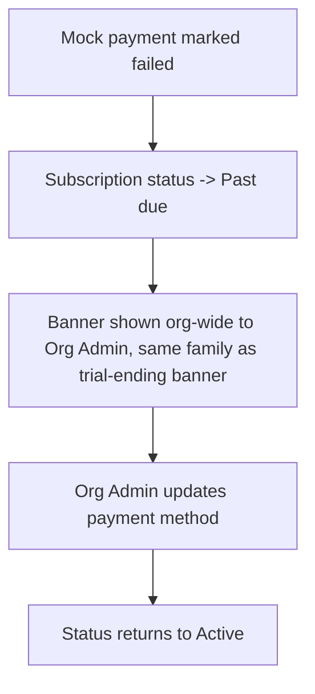

# Step 2 — User Flow — Full Billing

## Flow A — View & manage billing

## Flow B — Past due

## Carried into Step 3 (Sitemap)

Billing tab (current plan/seats/payment method/invoices), update-payment-method dialog, request-seats dialog, cancel-confirm dialog, past-due banner.
