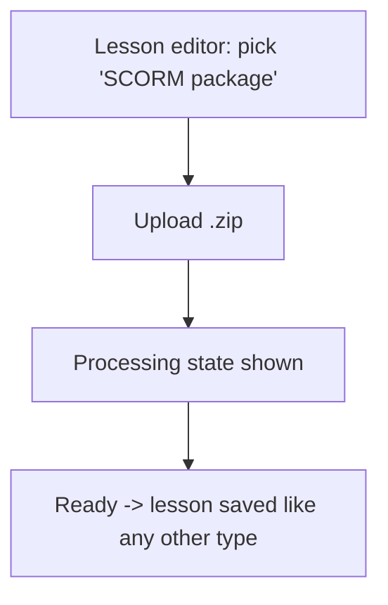
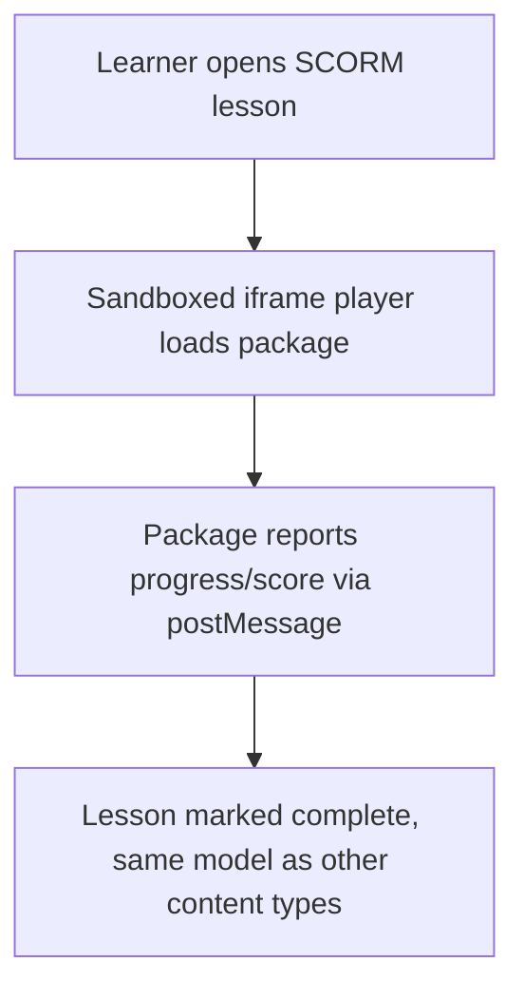
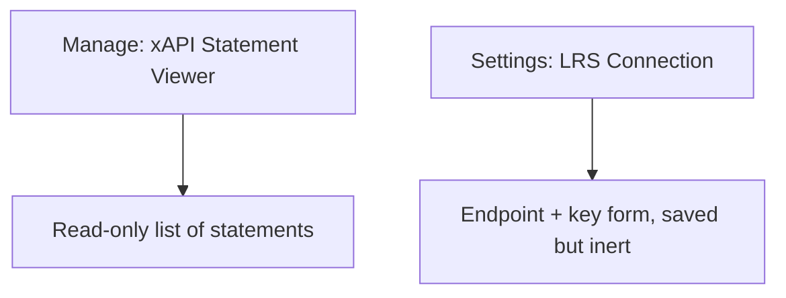

# Step 2 — User Flow — SCORM / xAPI

## Flow A — Upload a SCORM lesson

## Flow B — Take a SCORM lesson

## Flow C — Admin xAPI/LRS

## Carried into Step 3 (Sitemap)

SCORM upload (inside Lesson editor), sandboxed SCORM player, xAPI Statement Viewer, LRS Connection Settings.
